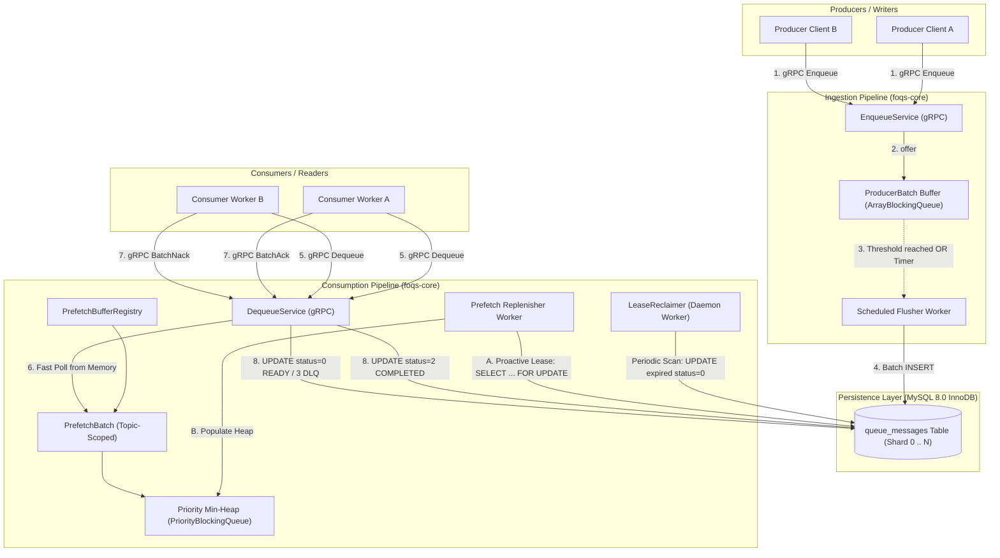
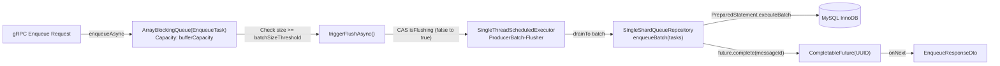
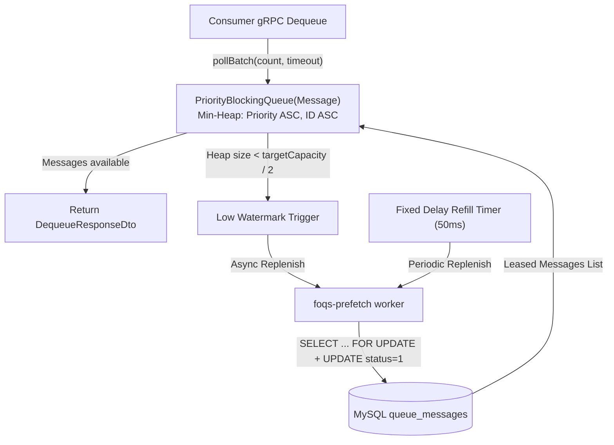
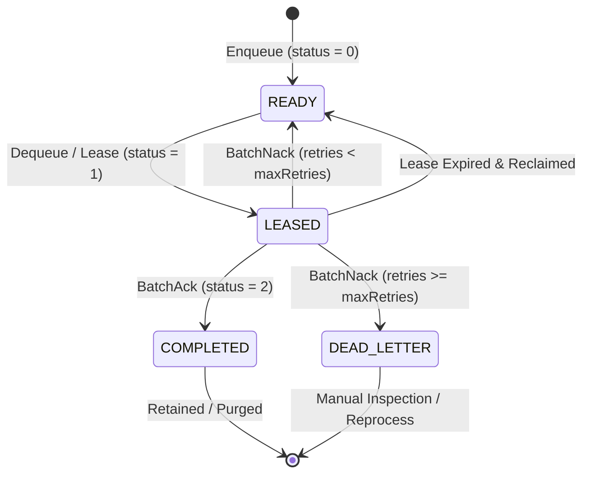
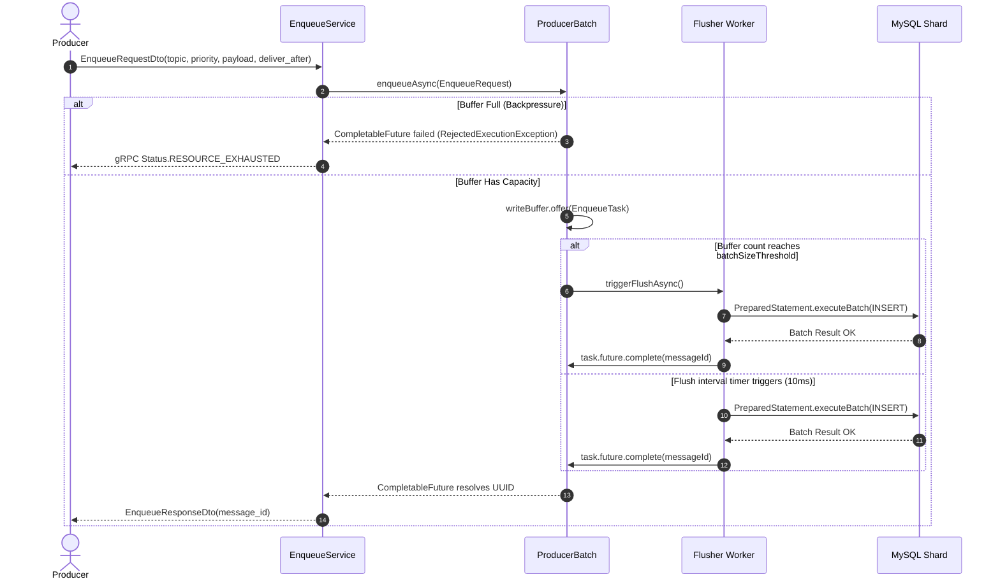
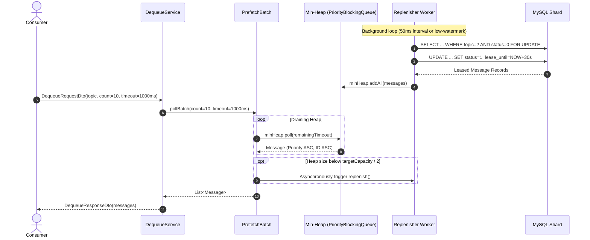
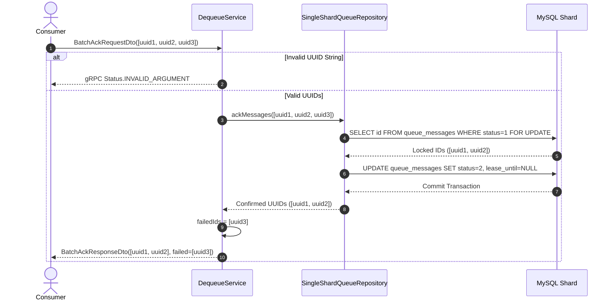
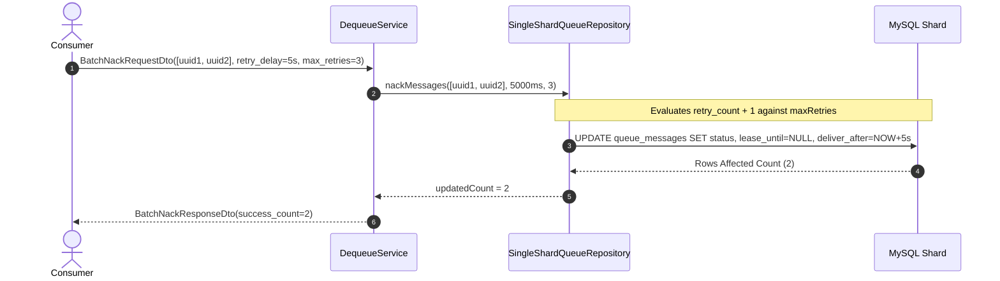
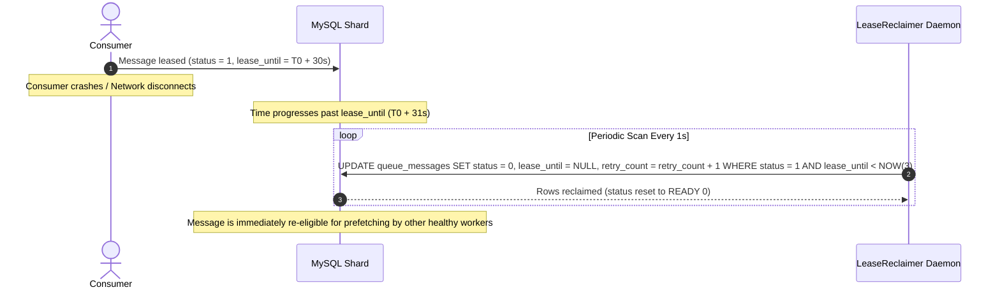

# FOQS (Facebook Ordered Queueing Service) — Technical Design, Architecture & API Reference

FOQS (**Facebook Ordered Queueing Service**) is an enterprise-grade, sharded, low-latency priority message queue service built with **Java 17**, **gRPC / Protocol Buffers 3**, **HikariCP**, and **MySQL InnoDB**. 

> [!NOTE]
> **Architectural Inspiration**: This system is inspired by Meta's (Facebook) production architecture published in [FOQS: Scaling a distributed priority queue (Meta Engineering Blog, 2021)](https://engineering.fb.com/2021/02/22/production-engineering/foqs-scaling-a-distributed-priority-queue/). It adopts Meta's core design tenets—including write-buffering with asynchronous database flushes, proactive in-memory priority prefetching, atomic lease-based consumer contracts, fine-grained ACK/NACK semantics with backoff delay, and background lease reclamation.

---

## Table of Contents

1. [Executive Summary & Key Features](#1-executive-summary--key-features)
2. [Meta FOQS Architectural Heritage & Design Mapping](#2-meta-foqs-architectural-heritage--design-mapping)
3. [System Architecture & Internals](#3-system-architecture--internals)
   - [3.1 High-Level Architecture Diagram](#31-high-level-architecture-diagram)
   - [3.2 Ingestion Pipeline (`ProducerBatch`)](#32-ingestion-pipeline-producerbatch)
   - [3.3 Consumption Pipeline (`PrefetchBatch` & `PrefetchBufferRegistry`)](#33-consumption-pipeline-prefetchbatch--prefetchbufferregistry)
   - [3.4 Storage Layer (`SingleShardQueueRepository`)](#34-storage-layer-singleshardqueuerepository)
   - [3.5 Background Recovery Daemon (`LeaseReclaimer`)](#35-background-recovery-daemon-leasereclaimer)
   - [3.6 Multi-Shard DataSource Manager (`DatasourceManager`)](#36-multi-shard-datasource-manager-datasourcemanager)
4. [Message Lifecycle & State Machine](#4-message-lifecycle--state-machine)
   - [4.1 State Transition Diagram](#41-state-transition-diagram)
   - [4.2 State Transition Matrix](#42-state-transition-matrix)
5. [Database Schema, Indexing & Storage Engine](#5-database-schema-indexing--storage-engine)
   - [5.1 DDL Specification](#51-ddl-specification)
   - [5.2 Index Design & Query Optimization Analysis](#52-index-design--query-optimization-analysis)
   - [5.3 Binary UUID (16-byte) vs String UUID (36-byte) Storage](#53-binary-uuid-16-byte-vs-string-uuid-36-byte-storage)
6. [End-to-End Workflows & Sequence Diagrams](#6-end-to-end-workflows--sequence-diagrams)
   - [6.1 Enqueue Workflow (Micro-batching & Backpressure)](#61-enqueue-workflow-micro-batching--backpressure)
   - [6.2 Prefetch & Dequeue Workflow (In-Memory Min-Heap)](#62-prefetch--dequeue-workflow-in-memory-min-heap)
   - [6.3 Message Acknowledgment Workflow (`BatchAck`)](#63-message-acknowledgment-workflow-batchack)
   - [6.4 Negative Acknowledgment & DLQ Workflow (`BatchNack`)](#64-negative-acknowledgment--dlq-workflow-batchnack)
   - [6.5 Consumer Crash & Automated Lease Recovery Workflow](#65-consumer-crash--automated-lease-recovery-workflow)
7. [Complete gRPC API Reference](#7-complete-grpc-api-reference)
   - [7.1 Protocol Buffers Definition](#71-protocol-buffers-definition)
   - [7.2 `EnqueueService.Enqueue`](#72-enqueueserviceenqueue)
   - [7.3 `DequeueService.Dequeue`](#73-dequeueservicedequeue)
   - [7.4 `DequeueService.BatchAck`](#74-dequeueservicebatchack)
   - [7.5 `DequeueService.BatchNack`](#75-dequeueservicebatchnack)
   - [7.6 Error Handling & Status Codes](#76-error-handling--status-codes)
8. [Client Usage Examples](#8-client-usage-examples)
   - [8.1 Java gRPC Client Example](#81-java-grpc-client-example)
   - [8.2 `grpcurl` CLI Examples](#82-grpcurl-cli-examples)
9. [Configuration & Deployment Guide](#9-configuration--deployment-guide)
   - [9.1 Configuration Properties Reference](#91-configuration-properties-reference)
   - [9.2 Docker Compose Quickstart](#92-docker-compose-quickstart)
   - [9.3 Liquibase Database Migration](#93-liquibase-database-migration)
   - [9.4 Production Tuning Recommendations](#94-production-tuning-recommendations)

---

## 1. Executive Summary & Key Features

FOQS provides the ordering and reliability guarantees of a relational database-backed queue while achieving the throughput and low latency of in-memory streaming brokers:

- **Micro-Batched Asynchronous Enqueueing**: Incoming producer messages enter an in-memory `ArrayBlockingQueue` and are flushed to disk in transactional micro-batches. This minimizes database round-trips and drastically reduces lock contention.
- **In-Memory Priority Min-Heap Prefetching**: For active topics, a dedicated background replenisher proactively leases messages from MySQL and loads them into a thread-safe `PriorityBlockingQueue` ordered by `priority ASC, id ASC`. Consumer `Dequeue` requests are served directly from RAM in $O(1)$ without synchronous database queries.
- **Strict At-Least-Once Delivery**: Messages are leased with an explicit `lease_until` expiration timestamp. If a consumer crashes or network drops, the message lease expires and the background `LeaseReclaimer` automatically makes the message available again.
- **Fine-Grained ACK and NACK**:
  - `BatchAck`: Marks messages as `COMPLETED (2)` and clears leases.
  - `BatchNack`: Allows consumers to reschedule failed messages with customizable backoff delays (`retryDelayMs`) and automatically routes messages exceeding `maxRetryCount` to `DEAD_LETTER (3)` status.
- **Compact Binary Storage**: UUIDs are stored as `BINARY(16)` instead of 36-byte strings, halving index memory requirements and maximizing InnoDB buffer pool hit ratios.

---

## 2. Meta FOQS Architectural Heritage & Design Mapping

Meta's engineering paper discusses how Facebook scaled its asynchronous compute infrastructure to process nearly **one trillion items per day** with backlogs reaching hundreds of billions of items across heterogeneous workloads. Below is how our FOQS implementation maps to the core design principles outlined in Meta's architecture:

| Meta FOQS Architecture Concept | Meta Production Design (FB Blog) | Our FOQS Implementation |
| :--- | :--- | :--- |
| **Storage Engine** | Sharded MySQL InnoDB | Sharded MySQL InnoDB with `DatasourceManager` & HikariCP |
| **Transport Protocol** | Apache Thrift RPC | gRPC over HTTP/2 with Protocol Buffers 3 |
| **Ingestion Pipeline** | In-memory write buffer per shard worker returning asynchronous Promise/Future | [`ProducerBatch`](file:///Users/khaitran/Projects/FOQS/foqs-core/src/main/java/project/khaihust/foqs/core/buffer/impl/ProducerBatch.java) backed by `ArrayBlockingQueue` & `CompletableFuture<UUID>` with size/time dual flusher |
| **Consumption Model** | **Pull-based** consumer model with in-memory prefetching | Pull-based `DequeueService.Dequeue` pulling from in-memory [`PrefetchBatch`](file:///Users/khaitran/Projects/FOQS/foqs-core/src/main/java/project/khaihust/foqs/core/buffer/impl/PrefetchBatch.java) min-heap |
| **Priority Ordering** | 32-bit integer priority (`lower integer = higher priority`), ties broken by deliver timestamp | 32-bit `priority` field; Min-Heap comparator ordering by `priority ASC, id ASC` |
| **Lease & At-Least-Once Delivery** | Time-bound lease duration; expired un-acked leases reclaimed automatically | Atomic lease (`status = 1`, `lease_until = NOW + duration`), recovered by [`LeaseReclaimer`](file:///Users/khaitran/Projects/FOQS/foqs-core/src/main/java/project/khaihust/foqs/core/buffer/impl/LeaseReclaimer.java) |
| **Negative Acknowledgment (NACK)** | NACK with delay for exponential backoff retry | `BatchNack` supporting `retry_delay_ms` and transition to `DEAD_LETTER (3)` upon `max_retry_count` |
| **Topic Lifecycle** | Lightweight, dynamic logical priority queues within namespaces | Dynamic topic-scoped prefetch buffers created on-demand via [`PrefetchBufferRegistry`](file:///Users/khaitran/Projects/FOQS/foqs-core/src/main/java/project/khaihust/foqs/core/buffer/impl/PrefetchBufferRegistry.java) |
| **Compact Keys** | Encoded shard ID + 64-bit primary key | 128-bit compact `BINARY(16)` UUIDs optimized for InnoDB memory footprint |


---

## 2. System Architecture & Internals

### 2.1 High-Level Architecture Diagram



---

### 3.2 Ingestion Pipeline (`ProducerBatch`)

The [`ProducerBatch`](file:///Users/khaitran/Projects/FOQS/foqs-core/src/main/java/project/khaihust/foqs/core/buffer/impl/ProducerBatch.java) decouples gRPC thread execution from database write latency.



#### Key Mechanics:
1. **Non-blocking Handoff**: `enqueueAsync(request)` wraps the payload into an `EnqueueTask` containing a `CompletableFuture<UUID>` and offers it to an in-memory `ArrayBlockingQueue`.
2. **Dual-Trigger Flushing**:
   - **Size-Trigger**: When the queue depth reaches `batchSizeThreshold` (default: 100), `triggerFlushAsync()` uses an `AtomicBoolean isFlushing` CAS guard to trigger an immediate batch flush on the flusher executor.
   - **Time-Trigger**: A background scheduled executor periodically calls `safeFlushAll()` every `flushIntervalMs` (default: 10 ms) to guarantee maximum latency bounds during low-traffic periods.
3. **Backpressure**: If the write buffer becomes full (`writeBuffer.offer(...) == false`), the service fails the future with a `RejectedExecutionException`, translating into a `Status.RESOURCE_EXHAUSTED` gRPC error to protect memory.

---

### 3.3 Consumption Pipeline (`PrefetchBatch` & `PrefetchBufferRegistry`)

To eliminate latency spikes on consumer dequeue calls, [`PrefetchBatch`](file:///Users/khaitran/Projects/FOQS/foqs-core/src/main/java/project/khaihust/foqs/core/buffer/impl/PrefetchBatch.java) maintains an in-memory priority min-heap per topic.



#### Key Mechanics:
1. **Topic Buffer Registry**: [`PrefetchBufferRegistry`](file:///Users/khaitran/Projects/FOQS/foqs-core/src/main/java/project/khaihust/foqs/core/buffer/impl/PrefetchBufferRegistry.java) uses a `ConcurrentHashMap` to lazily create and cache `PrefetchBatch` instances per topic.
2. **Min-Heap Structure**: Uses a `PriorityBlockingQueue<Message>` with comparator:
   ```java
   Comparator.comparingInt(Message::getPriority)
             .thenComparing(Message::getId)
   ```
3. **Low-Watermark Auto-Replenish**: During `pollBatch()`, if remaining heap items fall below `targetCapacity / 2`, the replenish worker is triggered immediately to refill from the database in the background.
4. **Timeout-Aware Polling**: When consumers request messages with a timeout, `pollBatch()` polls the min-heap with high-resolution nanosecond deadlines, returning immediately once the requested batch size is satisfied or the deadline expires.

---

### 3.4 Storage Layer (`SingleShardQueueRepository`)

[`SingleShardQueueRepository`](file:///Users/khaitran/Projects/FOQS/foqs-core/src/main/java/project/khaihust/foqs/core/storage/SingleShardQueueRepository.java) executes atomic JDBC queries against MySQL shards.

| Operation | SQL Pattern / Logic | Description |
| :--- | :--- | :--- |
| **`enqueueBatch`** | `INSERT INTO queue_messages (id, topic, priority, payload, status, deliver_after, created_at) VALUES (?, ?, ?, ?, 0, ?, ?)` | Batched JDBC execution using `PreparedStatement.addBatch()` and `executeBatch()`. |
| **`leaseMessages`** | `SELECT id, topic, priority, payload, status, deliver_after, lease_until, retry_count, created_at FROM queue_messages WHERE topic = ? AND status = 0 AND deliver_after <= ? ORDER BY priority ASC, id ASC LIMIT ? FOR UPDATE` followed by `UPDATE queue_messages SET status = 1, lease_until = ? WHERE id IN (...)` | Runs in an explicit transaction (`conn.setAutoCommit(false)`) to atomically claim and lock candidate messages. |
| **`ackMessages`** | `SELECT id FROM queue_messages WHERE status = 1 AND id IN (...) FOR UPDATE` followed by `UPDATE queue_messages SET status = 2, lease_until = NULL WHERE id IN (...)` | Only acknowledges messages currently in `LEASED` status; committed atomically. |
| **`nackMessages`** | `UPDATE queue_messages SET status = CASE WHEN retry_count + 1 >= ? THEN 3 ELSE 0 END, lease_until = NULL, deliver_after = ?, retry_count = retry_count + 1 WHERE status = 1 AND id IN (...)` | Conditionally transitions to `DEAD_LETTER (3)` or `READY (0)` with future `deliver_after` backoff. |
| **`reclaimExpiredLeases`** | `UPDATE queue_messages SET status = 0, lease_until = NULL, retry_count = retry_count + 1 WHERE status = 1 AND lease_until < ?` | Resets abandoned leases back to `READY` status. |

---

### 3.5 Background Recovery Daemon (`LeaseReclaimer`)

[`LeaseReclaimer`](file:///Users/khaitran/Projects/FOQS/foqs-core/src/main/java/project/khaihust/foqs/core/buffer/impl/LeaseReclaimer.java) runs as a singleton daemon scheduled executor (`foqs-lease-reclaimer`) configured with `reclaimerIntervalSeconds` (default: 1 second).

- Scans the covered index `idx_reclaim (status, lease_until)` for rows where `status = 1` and `lease_until < NOW(3)`.
- Resets them to `status = 0` (`READY`), clears `lease_until = NULL`, and increments `retry_count = retry_count + 1`.
- Prevents message loss when consumer worker processes crash, deadlock, or suffer hardware failure mid-execution.

---

### 3.6 Multi-Shard DataSource Manager (`DatasourceManager`)

[`DatasourceManager`](file:///Users/khaitran/Projects/FOQS/foqs-core/src/main/java/project/khaihust/foqs/core/config/DatasourceManager.java) initializes and maintains a collection of high-performance `HikariDataSource` connection pools keyed by shard index (`0 .. N-1`).

- Supports horizontal scaling across independent MySQL database shards.
- Manages connection pool properties (maximum pool size, timeout, keepalive, connection leak detection).

---

## 4. Message Lifecycle & State Machine

### 4.1 State Transition Diagram



---

### 3.2 State Transition Matrix

| From State | Event / Trigger | Guard Condition | To State | Modifications to Record |
| :--- | :--- | :--- | :--- | :--- |
| **`[*]`** | `EnqueueService.Enqueue` | Topic valid, payload present | **`READY (0)`** | `id` generated, `status = 0`, `deliver_after` set, `retry_count = 0`, `lease_until = NULL` |
| **`READY (0)`** | `PrefetchBatch.replenish` | `deliver_after <= NOW()` | **`LEASED (1)`** | `status = 1`, `lease_until = NOW() + leaseDuration` |
| **`LEASED (1)`** | `DequeueService.BatchAck` | Message ID matches locked row | **`COMPLETED (2)`** | `status = 2`, `lease_until = NULL` |
| **`LEASED (1)`** | `DequeueService.BatchNack` | `retry_count + 1 < maxRetryCount` | **`READY (0)`** | `status = 0`, `lease_until = NULL`, `deliver_after = NOW() + delay`, `retry_count++` |
| **`LEASED (1)`** | `DequeueService.BatchNack` | `retry_count + 1 >= maxRetryCount` | **`DEAD_LETTER (3)`**| `status = 3`, `lease_until = NULL`, `retry_count++` |
| **`LEASED (1)`** | `LeaseReclaimer` daemon | `lease_until < NOW()` | **`READY (0)`** | `status = 0`, `lease_until = NULL`, `retry_count++` |

---

## 4. Database Schema, Indexing & Storage Engine

### 4.1 DDL Specification

```sql
CREATE TABLE IF NOT EXISTS queue_messages (
    id BINARY(16) NOT NULL,
    topic VARCHAR(64) NOT NULL,
    priority INT NOT NULL DEFAULT 0,
    payload BLOB NOT NULL,
    status TINYINT NOT NULL DEFAULT 0,
    deliver_after TIMESTAMP(3) NOT NULL,
    lease_until TIMESTAMP(3) NULL,
    retry_count INT NOT NULL DEFAULT 0,
    created_at TIMESTAMP(3) DEFAULT CURRENT_TIMESTAMP(3),
    PRIMARY KEY (id),
    INDEX idx_fetch_priority (topic, status, deliver_after, priority ASC, id ASC),
    INDEX idx_reclaim (status, lease_until)
) ENGINE=InnoDB DEFAULT CHARSET=utf8mb4 COLLATE=utf8mb4_unicode_ci;
```

---

### 4.2 Index Design & Query Optimization Analysis

#### 1. Composite Index: `idx_fetch_priority (topic, status, deliver_after, priority ASC, id ASC)`
- **Purpose**: Powers the prefetch query:
  ```sql
  SELECT id, topic, priority, payload, status, deliver_after, lease_until, retry_count, created_at 
  FROM queue_messages 
  WHERE topic = ? AND status = 0 AND deliver_after <= ? 
  ORDER BY priority ASC, id ASC 
  LIMIT ? FOR UPDATE;
  ```
- **How It Works**:
  1. `topic` and `status` act as equality filters ($O(\log N)$ tree dive).
  2. `deliver_after` evaluates the range condition (`<= NOW()`).
  3. `priority ASC, id ASC` provides a deterministic sorted order directly from the BTREE without requiring an in-memory or on-disk `Using filesort`.

#### 2. Composite Index: `idx_reclaim (status, lease_until)`
- **Purpose**: Powers the background recovery query:
  ```sql
  UPDATE queue_messages 
  SET status = 0, lease_until = NULL, retry_count = retry_count + 1 
  WHERE status = 1 AND lease_until < ?;
  ```
- **How It Works**:
  Filters immediately to active leases (`status = 1`) and scans only expired timestamps, avoiding full table scans.

---

### 4.3 Binary UUID (16-byte) vs String UUID (36-byte) Storage

FOQS utilizes `UUIDUtil.asByteArray(uuid)` and `UUIDUtil.uuid(bytes)`:

| Metric | `BINARY(16)` (FOQS Implementation) | `CHAR(36)` (Standard String UUID) |
| :--- | :--- | :--- |
| **Row Storage Size** | 16 bytes | 36 bytes (or 144 bytes under UTF8MB4) |
| **Primary Key Index Size** | ~16 bytes per entry | ~36–144 bytes per entry |
| **Secondary Index Payload** | 16 bytes clustered reference | 36–144 bytes clustered reference |
| **InnoDB Buffer Pool Fit** | **~2.5x to 4x more records in RAM** | Higher cache eviction rate |
| **Comparison Speed** | Direct 128-bit integer/byte comparison | Character-by-character string comparison |

---

## 5. End-to-End Workflows & Sequence Diagrams

### 5.1 Enqueue Workflow (Micro-batching & Backpressure)



---

### 5.2 Prefetch & Dequeue Workflow (In-Memory Min-Heap)



---

### 5.3 Message Acknowledgment Workflow (`BatchAck`)



---

### 5.4 Negative Acknowledgment & DLQ Workflow (`BatchNack`)



---

### 5.5 Consumer Crash & Automated Lease Recovery Workflow



---

## 6. Complete gRPC API Reference

### 6.1 Protocol Buffers Definition

#### `enqueue.proto`
```protobuf
syntax = "proto3";

package project.khaihust.foqs.core.proto;

option java_multiple_files = true;
option java_package = "project.khaihust.foqs.core.proto";
option java_outer_classname = "EnqueueProto";

service EnqueueService {
  rpc Enqueue (EnqueueRequestDto) returns (EnqueueResponseDto);
}

message EnqueueRequestDto {
  string topic = 1;
  int32 priority = 2;
  bytes payload = 3;
  int64 deliver_after = 4;
}

message EnqueueResponseDto {
  string message_id = 1;
}
```

#### `dequeue.proto`
```protobuf
syntax = "proto3";

package project.khaihust.foqs.core.proto;

option java_multiple_files = true;
option java_package = "project.khaihust.foqs.core.proto";
option java_outer_classname = "DequeueProto";

service DequeueService {
  rpc Dequeue (DequeueRequestDto) returns (DequeueResponseDto);
  rpc BatchAck(BatchAckRequestDto) returns (BatchAckResponseDto);
  rpc BatchNack(BatchNackRequestDto) returns (BatchNackResponseDto);
}

message DequeueRequestDto {
  string topic = 1;
  int32 count = 2;
  int32 timeout = 3;
}

message DequeueResponseDto {
  repeated DequeuedMessageDto messages = 1;
}

message DequeuedMessageDto {
  string message_id = 1;
  string topic = 2;
  int32 priority = 3;
  bytes payload = 4;
  int64 lease_until_epoch_ms = 5;
  int32 retry_count = 6;
  int64 created_at_epoch_ms = 7;
}

message BatchAckRequestDto {
  repeated string message_ids = 1;
}

message BatchAckResponseDto {
  repeated string acked_message_ids = 1;
  repeated string failed_message_ids = 2;
}

message BatchNackRequestDto {
  repeated string message_ids = 1;
  int64 retry_delay_ms = 2;
  int32 max_retry_count = 3;
}

message BatchNackResponseDto {
  int32 success_count = 1;
}
```

---

### 6.2 `EnqueueService.Enqueue`

Publishes a message to a designated topic.

- **RPC Method**: `project.khaihust.foqs.core.proto.EnqueueService/Enqueue`

#### Request Parameters (`EnqueueRequestDto`)

| Field | Type | Required | Validation Rules | Description |
| :--- | :--- | :--- | :--- | :--- |
| `topic` | `string` | **Yes** | Non-empty, non-blank string | Target queue topic name (e.g. `order-events`). |
| `priority` | `int32` | No | Any integer | Priority value. Lower integers have higher dispatch priority (`0` > `1` > `10`). Defaults to `0`. |
| `payload` | `bytes` | **Yes** | Non-null bytes | Binary payload data (JSON, Protocol Buffers, Avro, etc.). |
| `deliver_after`| `int64` | No | Epoch millis | Delivery delay timestamp. If $\le \text{current timestamp}$, message is available immediately. |

#### Response (`EnqueueResponseDto`)

| Field | Type | Description | Example |
| :--- | :--- | :--- | :--- |
| `message_id` | `string` | Canonical UUID identifying the enqueued message. | `123e4567-e89b-12d3-a456-426614174000` |

---

### 6.3 `DequeueService.Dequeue`

Polls and leases a batch of messages from the topic's in-memory priority queue.

- **RPC Method**: `project.khaihust.foqs.core.proto.DequeueService/Dequeue`

#### Request Parameters (`DequeueRequestDto`)

| Field | Type | Required | Validation Rules | Description |
| :--- | :--- | :--- | :--- | :--- |
| `topic` | `string` | **Yes** | Non-empty, non-blank string | Topic to dequeue messages from. |
| `count` | `int32` | **Yes** | $> 0$ | Maximum number of messages to return in this batch. |
| `timeout` | `int32` | No | $\ge 0$ (millis) | Maximum time to wait if the buffer is empty. `0` returns immediately. |

#### Response (`DequeueResponseDto`)

| Field | Type | Description |
| :--- | :--- | :--- |
| `messages` | `repeated DequeuedMessageDto` | Array of leased messages matching topic, ordered by priority. |

#### Item Fields (`DequeuedMessageDto`)

| Field | Type | Description |
| :--- | :--- | :--- |
| `message_id` | `string` | Message UUID. |
| `topic` | `string` | Topic name. |
| `priority` | `int32` | Priority integer. |
| `payload` | `bytes` | Message payload byte buffer. |
| `lease_until_epoch_ms` | `int64` | Lease expiration timestamp in milliseconds. |
| `retry_count` | `int32` | Current number of retry attempts. |
| `created_at_epoch_ms` | `int64` | Creation timestamp in milliseconds. |

---

### 6.4 `DequeueService.BatchAck`

Acknowledges successful message processing, transitioning messages from `LEASED (1)` to `COMPLETED (2)`.

- **RPC Method**: `project.khaihust.foqs.core.proto.DequeueService/BatchAck`

#### Request Parameters (`BatchAckRequestDto`)

| Field | Type | Required | Description |
| :--- | :--- | :--- | :--- |
| `message_ids` | `repeated string` | **Yes** | List of UUID strings to acknowledge. |

#### Response (`BatchAckResponseDto`)

| Field | Type | Description |
| :--- | :--- | :--- |
| `acked_message_ids` | `repeated string` | UUIDs successfully verified in `LEASED` status and transitioned to `COMPLETED`. |
| `failed_message_ids`| `repeated string` | UUIDs that could not be ACKed (already completed, lease expired, unleased, or non-existent). |

---

### 6.5 `DequeueService.BatchNack`

Negatively acknowledges messages, allowing for retry backoff or DLQ routing.

- **RPC Method**: `project.khaihust.foqs.core.proto.DequeueService/BatchNack`

#### Request Parameters (`BatchNackRequestDto`)

| Field | Type | Required | Description |
| :--- | :--- | :--- | :--- |
| `message_ids` | `repeated string` | **Yes** | List of UUID strings to NACK. |
| `retry_delay_ms` | `int64` | No | Backoff delay in milliseconds before the message becomes eligible for consumption again (`deliver_after = NOW() + retry_delay_ms`). Defaults to `0`. |
| `max_retry_count` | `int32` | No | Maximum retries allowed. If `retry_count + 1 >= max_retry_count`, the status transitions to `DEAD_LETTER (3)`. Defaults to `5` if $\le 0$. |

#### Response (`BatchNackResponseDto`)

| Field | Type | Description |
| :--- | :--- | :--- |
| `success_count` | `int32` | Total number of rows successfully updated (rescheduled or moved to DLQ). |

---

### 6.6 Error Handling & Status Codes

| gRPC Status Code | Triggering Condition | Corrective Client Action |
| :--- | :--- | :--- |
| **`INVALID_ARGUMENT`** | Empty topic, `count <= 0`, or malformed UUID string passed in ACK/NACK. | Correct the input parameter formatting. |
| **`RESOURCE_EXHAUSTED`** | In-memory `writeBuffer` is saturated due to ingestion rate exceeding DB batch throughput. | Apply exponential backoff and retry on the producer client. |
| **`CANCELLED`** | Polling thread was interrupted or client aborted RPC stream. | Re-open channel or retry poll request. |
| **`INTERNAL`** | Uncaught storage error or database connection failure. | Check service logs and MySQL health metrics. |

---

## 7. Client Usage Examples

### 7.1 Java gRPC Client Example

```java
package com.example.client;

import com.google.protobuf.ByteString;
import io.grpc.ManagedChannel;
import io.grpc.ManagedChannelBuilder;
import project.khaihust.foqs.core.proto.*;

import java.nio.charset.StandardCharsets;
import java.util.List;

public class FoqsClientExample {
    public static void main(String[] args) {
        ManagedChannel channel = ManagedChannelBuilder.forAddress("localhost", 8080)
                .usePlaintext()
                .build();

        EnqueueServiceGrpc.EnqueueServiceBlockingStub enqueueStub = EnqueueServiceGrpc.newBlockingStub(channel);
        DequeueServiceGrpc.DequeueServiceBlockingStub dequeueStub = DequeueServiceGrpc.newBlockingStub(channel);

        // 1. Enqueue a High-Priority Message
        String topic = "order-fulfillment";
        EnqueueResponseDto enqueueResp = enqueueStub.enqueue(EnqueueRequestDto.newBuilder()
                .setTopic(topic)
                .setPriority(1) // Priority 1 (High)
                .setPayload(ByteString.copyFrom("{\"orderId\":\"ORD-9901\"}", StandardCharsets.UTF_8))
                .setDeliverAfter(System.currentTimeMillis())
                .build());

        System.out.println("Enqueued message ID: " + enqueueResp.getMessageId());

        // 2. Dequeue Messages
        DequeueResponseDto dequeueResp = dequeueStub.dequeue(DequeueRequestDto.newBuilder()
                .setTopic(topic)
                .setCount(10)
                .setTimeout(3000) // 3 seconds timeout
                .build());

        for (DequeuedMessageDto msg : dequeueResp.getMessagesList()) {
            System.out.println("Processing msg: " + msg.getMessageId() + ", payload: " + msg.getPayload().toStringUtf8());

            try {
                // Process message business logic...
                boolean processSuccess = true;

                if (processSuccess) {
                    // 3. Batch ACK on success
                    BatchAckResponseDto ackResp = dequeueStub.batchAck(BatchAckRequestDto.newBuilder()
                            .addMessageIds(msg.getMessageId())
                            .build());
                    System.out.println("ACKed IDs: " + ackResp.getAckedMessageIdsList());
                } else {
                    // 4. Batch NACK on failure (retry after 5s, max 3 retries)
                    BatchNackResponseDto nackResp = dequeueStub.batchNack(BatchNackRequestDto.newBuilder()
                            .addMessageIds(msg.getMessageId())
                            .setRetryDelayMs(5000)
                            .setMaxRetryCount(3)
                            .build());
                    System.out.println("NACKed count: " + nackResp.getSuccessCount());
                }
            } catch (Exception e) {
                e.printStackTrace();
            }
        }

        channel.shutdown();
    }
}
```

---

### 7.2 `grpcurl` CLI Examples

#### Enqueue Message:
```bash
grpcurl -plaintext -d '{
  "topic": "orders",
  "priority": 1,
  "payload": "eydvcmRlcklkJzogMTIzfQ==",
  "deliver_after": 0
}' localhost:8080 project.khaihust.foqs.core.proto.EnqueueService/Enqueue
```

#### Dequeue Messages:
```bash
grpcurl -plaintext -d '{
  "topic": "orders",
  "count": 5,
  "timeout": 2000
}' localhost:8080 project.khaihust.foqs.core.proto.DequeueService/Dequeue
```

#### Batch ACK:
```bash
grpcurl -plaintext -d '{
  "message_ids": ["c1e55047-97d8-4f81-9b16-43b9e4a3e218"]
}' localhost:8080 project.khaihust.foqs.core.proto.DequeueService/BatchAck
```

#### Batch NACK:
```bash
grpcurl -plaintext -d '{
  "message_ids": ["c1e55047-97d8-4f81-9b16-43b9e4a3e218"],
  "retry_delay_ms": 3000,
  "max_retry_count": 3
}' localhost:8080 project.khaihust.foqs.core.proto.DequeueService/BatchNack
```

---

## 8. Configuration & Deployment Guide

### 8.1 Configuration Properties Reference

Configuration is loaded from `application.properties` and profile files (e.g. `application-local.properties`, `application-prod.properties`):

| Property Key | Default Value | Description |
| :--- | :--- | :--- |
| `foqs.profile` | `local` | Active configuration profile (`local`, `prod`, `test`). |
| `foqs.server.port` | `8080` | Listening port for the gRPC server (`0` for random port in tests). |
| `foqs.producer.bufferCapacity` | `10000` | In-memory `ArrayBlockingQueue` capacity for incoming enqueue requests. |
| `foqs.producer.batchThreshold` | `100` | Number of messages accumulated before triggering an immediate batch insert. |
| `foqs.producer.flushIntervalMs`| `10` | Maximum wait time in milliseconds before flushing pending enqueue buffers. |
| `foqs.prefetch.targetCapacity` | `1000` | In-memory min-heap target size maintained per topic. |
| `foqs.prefetch.leaseDurationSeconds` | `30` | Duration in seconds granted to a leased message. |
| `foqs.prefetch.refillIntervalMs` | `50` | Frequency in milliseconds of the background prefetch replenish check. |
| `foqs.reclaimer.intervalSeconds` | `1` | Interval in seconds for the background lease recovery daemon. |
| `foqs.shards.count` | `1` | Number of configured database shards. |
| `foqs.shards.<index>.url` | — | JDBC connection URL for shard `<index>`. |
| `foqs.shards.<index>.username` | `root` | Database username for shard `<index>`. |
| `foqs.shards.<index>.password` | `root` | Database password for shard `<index>`. |

---

### 8.2 Docker Compose Quickstart

The [`docker/docker-compose.yml`](file:///Users/khaitran/Projects/FOQS/docker/docker-compose.yml) starts the default MySQL 8.0 shard container:

```yaml
version: '3.8'

services:
  mysql-shard-0:
    image: mysql:8.0
    container_name: foqs-mysql-shard-0
    environment:
      MYSQL_ROOT_PASSWORD: root
      MYSQL_DATABASE: foqs_shard_0
    ports:
      - "3306:3306"
    command: --default-authentication-plugin=mysql_native_password
```

Start the container:
```bash
docker compose -f docker/docker-compose.yml up -d
```

---

### 8.3 Liquibase Database Migration

FOQS uses **Liquibase** for database versioning located in `foqs-migration`:

```bash
# Run migration across all configured shards
mvn clean compile exec:java -pl foqs-migration -Dexec.mainClass="project.khaihust.foqs.migration.MigrationRunner"
```

---

### 8.4 Production Tuning Recommendations

1. **MySQL InnoDB Buffer Pool**:
   - Allocate 70–80% of total host RAM to `innodb_buffer_pool_size` to ensure `idx_fetch_priority` and `queue_messages` reside completely in memory.
   - Set `innodb_flush_log_at_trx_commit = 2` for high-throughput messaging where OS-level crash tolerance is acceptable.
2. **HikariCP Sizing**:
   - Set `maximumPoolSize = 20–50` per shard depending on the number of concurrent worker threads.
   - Set `minimumIdle = 10` to eliminate connection creation overhead during traffic bursts.
3. **JVM Configuration**:
   - Use the G1 Garbage Collector with low latency target pause times:
     ```bash
     java -XX:+UseG1GC -XX:MaxGCPauseMillis=20 -Xms4g -Xmx4g -jar foqs-core.jar
     ```
