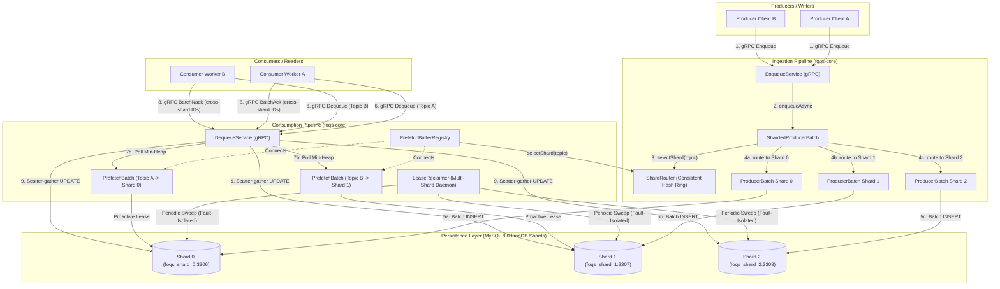
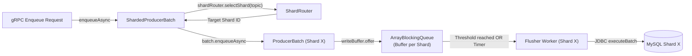
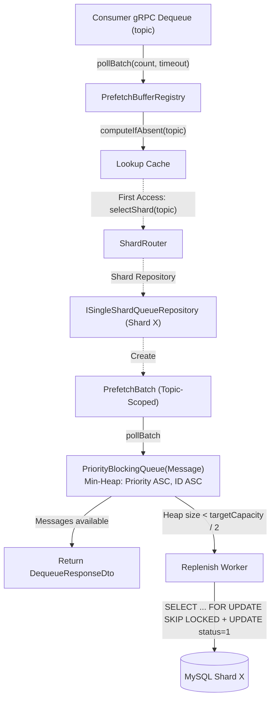
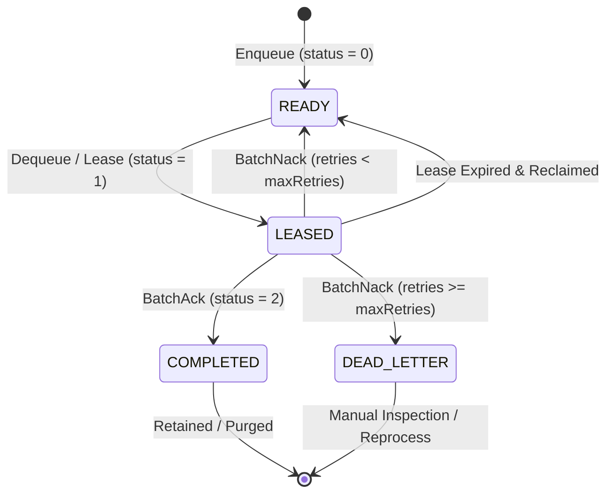
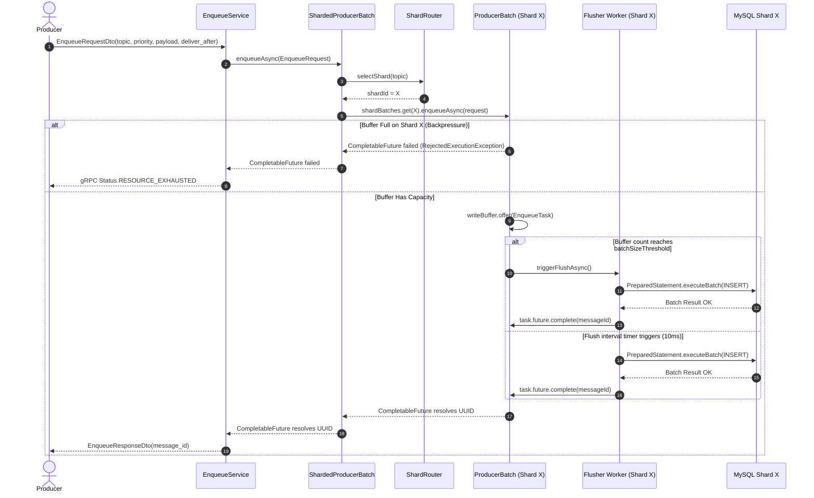
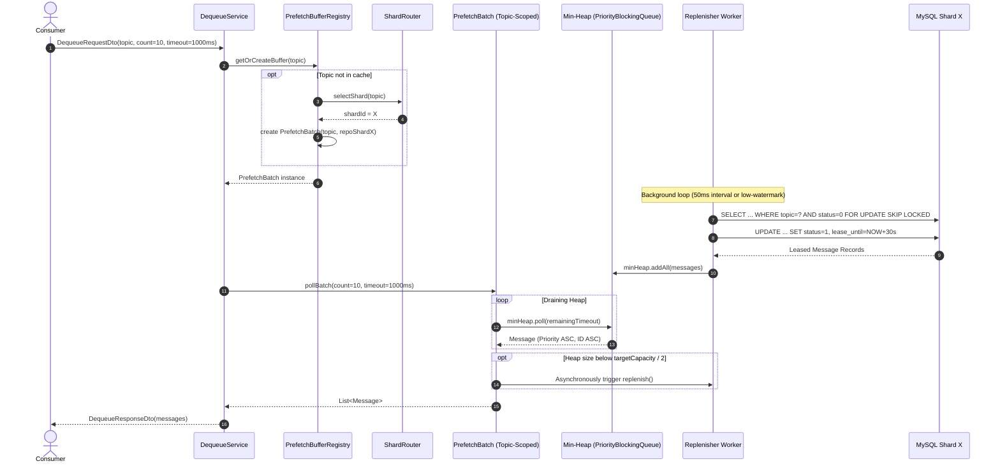
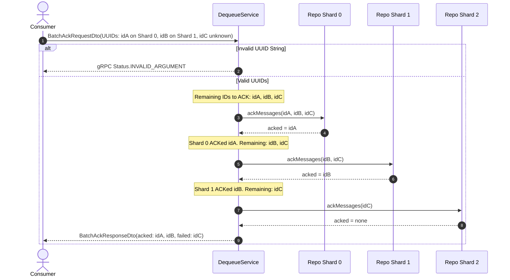
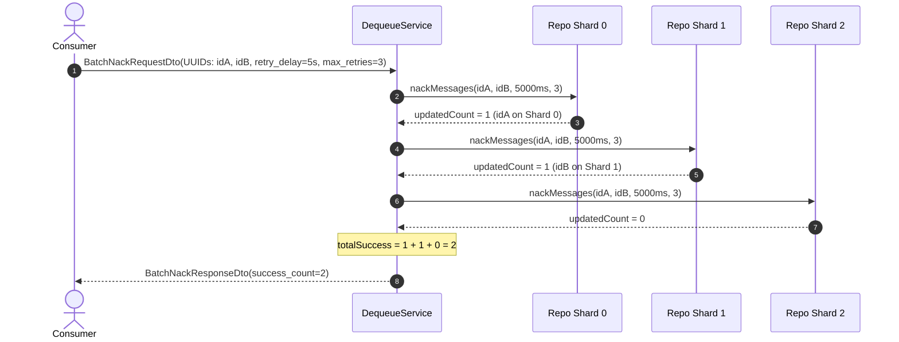
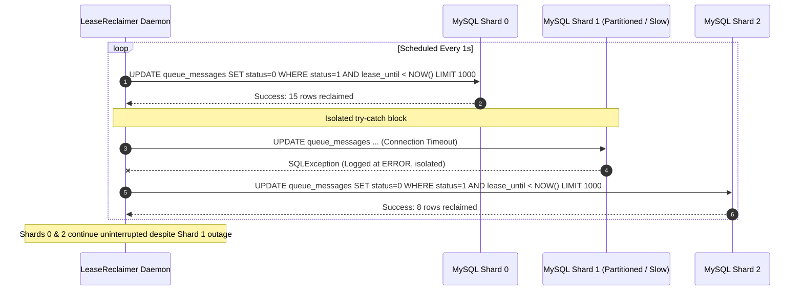

# FOQS (Facebook Ordered Queueing Service) — Technical Design, Architecture & API Reference

FOQS (**Facebook Ordered Queueing Service**) is a sharded, low-latency priority message queue service built with **Java 17**, **gRPC / Protocol Buffers 3**, **HikariCP**, and **MySQL InnoDB**. 

> [!NOTE]
> **Architectural Inspiration**: This system is inspired by Meta's (Facebook) production architecture published in [FOQS: Scaling a distributed priority queue (Meta Engineering Blog, 2021)](https://engineering.fb.com/2021/02/22/production-engineering/foqs-scaling-a-distributed-priority-queue/). It adopts Meta's core design tenets—including write-buffering with asynchronous database flushes, proactive in-memory priority prefetching, atomic lease-based consumer contracts, fine-grained ACK/NACK semantics with backoff delay, and background lease reclamation.

---

### Table of Contents

1. [Executive Summary & Key Features](#1-executive-summary--key-features)
2. [Meta FOQS Architectural Heritage & Design Mapping](#2-meta-foqs-architectural-heritage--design-mapping)
3. [System Architecture & Internals](#3-system-architecture--internals)
   - [3.1 High-Level Sharded Architecture Diagram](#31-high-level-sharded-architecture-diagram)
   - [3.2 Consistent Hashing Shard Router (`ShardRouter`)](#32-consistent-hashing-shard-router-shardrouter)
   - [3.3 Sharded Ingestion Pipeline (`ShardedProducerBatch` & `ProducerBatch`)](#33-sharded-ingestion-pipeline-shardedproducerbatch--producerbatch)
   - [3.4 Sharded Consumption Pipeline (`PrefetchBatch` & `PrefetchBufferRegistry`)](#34-sharded-consumption-pipeline-prefetchbatch--prefetchbufferregistry)
   - [3.5 Cross-Shard Scatter-Gather ACK & NACK Operations (`DequeueService`)](#35-cross-shard-scatter-gather-ack--nack-operations-dequeueservice)
   - [3.6 Storage Layer (`SingleShardQueueRepository`)](#36-storage-layer-singleshardqueuerepository)
   - [3.7 Background Recovery Daemon (`LeaseReclaimer`)](#37-background-recovery-daemon-leasereclaimer)
   - [3.8 Multi-Shard DataSource Manager (`DatasourceManager`)](#38-multi-shard-datasource-manager-datasourcemanager)
4. [Message Lifecycle & State Machine](#4-message-lifecycle--state-machine)
   - [4.1 State Transition Diagram](#41-state-transition-diagram)
   - [4.2 State Transition Matrix](#42-state-transition-matrix)
5. [Database Schema, Indexing & Storage Engine](#5-database-schema-indexing--storage-engine)
   - [5.1 DDL Specification](#51-ddl-specification)
   - [5.2 Index Design & Query Optimization Analysis](#52-index-design--query-optimization-analysis)
   - [5.3 Binary UUID (16-byte) vs String UUID (36-byte) Storage](#53-binary-uuid-16-byte-vs-string-uuid-36-byte-storage)
6. [End-to-End Workflows & Sequence Diagrams](#6-end-to-end-workflows--sequence-diagrams)
   - [6.1 Multi-Shard Enqueue Workflow (`ShardRouter` & Micro-batching)](#61-multi-shard-enqueue-workflow-shardrouter--micro-batching)
   - [6.2 Sharded Prefetch & Dequeue Workflow (In-Memory Min-Heap)](#62-sharded-prefetch--dequeue-workflow-in-memory-min-heap)
   - [6.3 Cross-Shard Scatter-Gather Acknowledgment (`BatchAck`)](#63-cross-shard-scatter-gather-acknowledgment-batchack)
   - [6.4 Cross-Shard Scatter-Gather Negative Acknowledgment (`BatchNack`)](#64-cross-shard-scatter-gather-negative-acknowledgment-batchnack)
   - [6.5 Multi-Shard Fault-Isolated Lease Recovery Workflow](#65-multi-shard-fault-isolated-lease-recovery-workflow)
7. [Complete gRPC API Reference](#7-complete-grpc-api-reference)
   - [7.1 Protocol Buffers Definition](#71-protocol-buffers-definition)
   - [7.2 `EnqueueService.Enqueue`](#72-enqueueserviceenqueue)
   - [7.3 `DequeueService.Dequeue`](#73-dequeueservicedequeue)
   - [7.4 `DequeueService.BatchAck`](#74-dequeueservicebatchack)
   - [7.5 `DequeueService.BatchNack`](#75-dequeueservicebatchnack)
   - [7.6 Error Handling & Status Codes](#76-error-handling--status-codes)
8. [Client Usage Examples](#8-client-usage-examples)
   - [8.1 Java gRPC Client Example](#81-java-grpc-client-example)
   - [8.2 `grpcurl` CLI Examples](#82-grpcurl-cli-examples)
9. [Configuration & Deployment Guide](#9-configuration--deployment-guide)
   - [9.1 Configuration Properties Reference](#91-configuration-properties-reference)
   - [9.2 Docker Compose Quickstart (3-Shard Cluster)](#92-docker-compose-quickstart-3-shard-cluster)
   - [9.3 Liquibase Database Migration](#93-liquibase-database-migration)
   - [9.4 Production Tuning Recommendations](#94-production-tuning-recommendations)
10. [Performance Benchmarks & Empirical Evaluation](#10-performance-benchmarks--empirical-evaluation)
   - [10.1 Open-Loop Benchmark Harness (`foqs-bench`)](#101-open-loop-benchmark-harness-foqs-bench)
   - [10.2 Experiment 1: Baseline Knee Characterization](#102-experiment-1-baseline-knee-characterization)
   - [10.3 Experiment 2: Micro-Batch Sweeps & Latency Tradeoffs](#103-experiment-2-micro-batch-sweeps--latency-tradeoffs)
   - [10.4 Experiment 3: Backlog, Working Set Spills & Query Plan Diagnosis](#104-experiment-3-backlog-working-set-spills--query-plan-diagnosis)
   - [10.5 Experiment 4: Lease Recovery & Fault Tolerance](#105-experiment-4-lease-recovery--fault-tolerance)
   - [10.6 Experiment 5: Horizontal Shard Scaling (1 vs 3 Shards) & Distribution Gate](#106-experiment-5-horizontal-shard-scaling-1-vs-3-shards--distribution-gate)
   - [10.7 Key Takeaways & Recommended Action Items](#107-key-takeaways--recommended-action-items)

---

## 1. Executive Summary & Key Features

FOQS provides the ordering and reliability guarantees of a relational database-backed queue while achieving the throughput and low latency of in-memory streaming brokers:

- **Consistent Hashing & Dynamic Shard Striping**: Topics are deterministically partitioned across multiple physical database shards using MurmurHash3 (`murmur3_128`) consistent hashing with virtual nodes ([`ShardRouter`](foqs-core/src/main/java/project/khaihust/foqs/core/config/ShardRouter.java)). Producers write to isolated shard-level write buffers ([`ShardedProducerBatch`](foqs-core/src/main/java/project/khaihust/foqs/core/buffer/impl/ShardedProducerBatch.java)), and consumers prefetch from shard-routed min-heaps ([`PrefetchBufferRegistry`](foqs-core/src/main/java/project/khaihust/foqs/core/buffer/impl/PrefetchBufferRegistry.java)), delivering linear horizontal scalability.
- **Cross-Shard Scatter-Gather Operations**: Consumer batch ACK and NACK calls support message UUIDs belonging to different physical shards. The service automatically fans out calls across shard repositories and aggregates acknowledgments with zero cross-shard locking penalty.
- **Micro-Batched Asynchronous Enqueueing**: Incoming producer messages enter an in-memory `ArrayBlockingQueue` per shard and are flushed to disk in transactional micro-batches. This minimizes database round-trips and eliminates lock contention across topics.
- **In-Memory Priority Min-Heap Prefetching**: For active topics, a dedicated background replenisher proactively leases messages from MySQL and loads them into a thread-safe `PriorityBlockingQueue` ordered by `priority ASC, id ASC`. Consumer `Dequeue` requests are served directly from RAM in $O(1)$ without synchronous database queries.
- **Strict At-Least-Once Delivery**: Messages are leased with an explicit `lease_until` expiration timestamp. If a consumer crashes or network drops, the message lease expires and the background `LeaseReclaimer` automatically sweeps and recovers expired messages across all configured shards with fault isolation.
- **Fine-Grained ACK and NACK**:
  - `BatchAck`: Marks messages as `COMPLETED (2)` and clears leases.
  - `BatchNack`: Allows consumers to reschedule failed messages with customizable backoff delays (`retryDelayMs`) and automatically routes messages exceeding `maxRetryCount` to `DEAD_LETTER (3)` status.
- **Compact Binary Storage**: UUIDs are stored as `BINARY(16)` instead of 36-byte strings, halving index memory requirements and maximizing InnoDB buffer pool hit ratios.

---

## 2. Meta FOQS Architectural Heritage & Design Mapping

Meta's engineering paper discusses how Facebook scaled its asynchronous compute infrastructure to process nearly **one trillion items per day** with backlogs reaching hundreds of billions of items across heterogeneous workloads. Below is how our FOQS implementation maps to the core design principles outlined in Meta's architecture:

| Meta FOQS Architecture Concept | Meta Production Design (FB Blog) | Our FOQS Implementation |
| :--- | :--- | :--- |
| **Storage Engine** | Sharded MySQL InnoDB clusters | Sharded MySQL InnoDB with [`DatasourceManager`](foqs-core/src/main/java/project/khaihust/foqs/core/config/DatasourceManager.java) & HikariCP |
| **Transport Protocol** | Apache Thrift RPC | gRPC over HTTP/2 with Protocol Buffers 3 |
| **Shard Routing** | Consistent hashing with virtual nodes mapping topics/namespaces to storage shards | [`ShardRouter`](foqs-core/src/main/java/project/khaihust/foqs/core/config/ShardRouter.java) using MurmurHash3 (`murmur3_128`) consistent hash ring with configurable virtual nodes |
| **Ingestion Pipeline** | In-memory write buffer per shard worker returning asynchronous Promise/Future | [`ShardedProducerBatch`](foqs-core/src/main/java/project/khaihust/foqs/core/buffer/impl/ShardedProducerBatch.java) delegating to shard-specific [`ProducerBatch`](foqs-core/src/main/java/project/khaihust/foqs/core/buffer/impl/ProducerBatch.java) instances backed by `ArrayBlockingQueue` & `CompletableFuture<UUID>` |
| **Consumption Model** | **Pull-based** consumer model with in-memory prefetching | Pull-based `DequeueService.Dequeue` pulling from in-memory [`PrefetchBatch`](foqs-core/src/main/java/project/khaihust/foqs/core/buffer/impl/PrefetchBatch.java) min-heap mapped by [`PrefetchBufferRegistry`](foqs-core/src/main/java/project/khaihust/foqs/core/buffer/impl/PrefetchBufferRegistry.java) |
| **Priority Ordering** | 32-bit integer priority (`lower integer = higher priority`), ties broken by deliver timestamp | 32-bit `priority` field; Min-Heap comparator ordering by `priority ASC, id ASC` |
| **Lease & At-Least-Once Delivery** | Time-bound lease duration; expired un-acked leases reclaimed automatically | Atomic lease (`status = 1`, `lease_until = NOW + duration`), recovered across all shards by [`LeaseReclaimer`](foqs-core/src/main/java/project/khaihust/foqs/core/buffer/impl/LeaseReclaimer.java) |
| **Negative Acknowledgment (NACK)** | NACK with delay for exponential backoff retry | Scatter-gather `BatchNack` supporting `retry_delay_ms` and transition to `DEAD_LETTER (3)` upon `max_retry_count` |
| **Topic Lifecycle** | Lightweight, dynamic logical priority queues within namespaces | Dynamic topic-scoped prefetch buffers created on-demand and pinned to designated shards |
| **Compact Keys** | Encoded shard ID + 64-bit primary key | 128-bit compact `BINARY(16)` UUIDs optimized for InnoDB memory footprint |

---

## 3. System Architecture & Internals

### 3.1 High-Level Sharded Architecture Diagram



---

### 3.2 Consistent Hashing Shard Router (`ShardRouter`)

The [`ShardRouter`](foqs-core/src/main/java/project/khaihust/foqs/core/config/ShardRouter.java) provides deterministic, uniform distribution of topics across database shards without central coordination or runtime network calls.

#### 1. MurmurHash3 (`murmur3_128`) Hashing Algorithm
`ShardRouter` utilizes MurmurHash3 (`murmur3_128` with seed 10):
```java
private static final HashFunction HASH_FUNCTION = Hashing.murmur3_128(10);

private long hash(String key) {
    return HASH_FUNCTION.hashString(key, StandardCharsets.UTF_8).asLong();
}
```

> [!IMPORTANT]
> **Why MurmurHash3 over FNV-1a?**  
> FNV-1a exhibits weak avalanche characteristics on structured keys with near-identical prefixes (such as `"shard-N-vnode-M"` and `"bench-topic-K"`). In empirical distribution testing across 60 topics on 3 shards, FNV-1a resulted in severe ring clustering where Shard 1 received **0% of traffic** and Shard 0 received **83.3%** (a 150% distribution skew).  
> Swapping to MurmurHash3 provides full bit-avalanche behavior, flattening ring clustering and reducing observed shard skew to **5.00%** (`[26250, 24999, 23750]` across 75k enqueued messages), well within the $\pm 15\%$ production distribution tolerance.

#### 2. Virtual Node Hash Ring
To prevent hotspots and preserve uniformity across heterogeneous topic names, each physical shard ID is mapped to multiple virtual nodes on a circular ring:
- **Virtual Node Key Template**: `"shard-" + shardId + "-vnode-" + virtualId`
- **Data Structure**: `NavigableMap<Long, Integer> ring = new TreeMap<>()`
- **Virtual Nodes per Shard**: Configured via constructor (default: 128 virtual nodes per shard).

#### 3. Ring Lookup ($O(\log(K \times V))$)
When selecting the shard for a topic:
```java
public int selectShard(String topic) {
    long hash = hash(topic);
    Map.Entry<Long, Integer> entry = ring.ceilingEntry(hash);
    if (entry == null) {
        entry = ring.firstEntry(); // Circular ring wraparound
    }
    return entry.getValue();
}
```
- **Thread Safety**: The ring is fully constructed and populated in the constructor and becomes immutable thereafter. Reads require no synchronization or locks.
- **Fail-Fast Validation**: Requires non-null, non-empty `shardIds`, `virtualNodes > 0`, and non-blank `topic` strings.

---

### 3.3 Sharded Ingestion Pipeline (`ShardedProducerBatch` & `ProducerBatch`)

The [`ShardedProducerBatch`](foqs-core/src/main/java/project/khaihust/foqs/core/buffer/impl/ShardedProducerBatch.java) implements [`IProducerBatch`](foqs-core/src/main/java/project/khaihust/foqs/core/buffer/IProducerBatch.java) and routes incoming write requests to dedicated per-shard [`ProducerBatch`](foqs-core/src/main/java/project/khaihust/foqs/core/buffer/impl/ProducerBatch.java) instances.



#### Key Mechanics:
1. **Independent Shard Buffering**: Each shard maintains its own `ArrayBlockingQueue` write buffer and dedicated scheduled flusher thread. A traffic spike or slow database on Shard 0 will **never** stall, delay, or block writes destined for Shard 1 or Shard 2.
2. **Dual-Trigger Batching per Shard**:
   - **Size-Trigger**: When an individual shard's queue depth reaches `batchSizeThreshold` (default: 100), it triggers an immediate batch flush for that shard.
   - **Time-Trigger**: Periodic flush every `flushIntervalMs` (default: 10ms) guarantees tight latency bounds during low-traffic periods.
3. **Safe Asynchronous Handoff**: If a request contains an invalid topic or targets an unconfigured shard, `ShardedProducerBatch` immediately returns a `CompletableFuture.failedFuture(...)` without throwing unhandled exceptions on caller threads.
4. **Clean Lifecycle Management**: Calling `close()` traverses all underlying shard batches and uses `Throwable.addSuppressed()` so that a failure closing one shard does not abort closing remaining shards.

---

### 3.4 Sharded Consumption Pipeline (`PrefetchBufferRegistry` & `PrefetchBatch`)

To provide instant in-memory dequeuing across multiple shards, [`PrefetchBufferRegistry`](foqs-core/src/main/java/project/khaihust/foqs/core/buffer/impl/PrefetchBufferRegistry.java) binds each topic to a dedicated in-memory [`PrefetchBatch`](foqs-core/src/main/java/project/khaihust/foqs/core/buffer/impl/PrefetchBatch.java) connected to the topic's designated database shard.



#### Key Mechanics:
1. **Dynamic Shard Resolution**: On the first dequeue request for a topic, `PrefetchBufferRegistry` queries `shardRouter.selectShard(topic)` to retrieve the corresponding shard's repository. If the shard is not configured in the cluster, an informative `IllegalStateException` is thrown immediately.
2. **Fast In-Memory Path**: Subsequent dequeue calls for the same topic hit the `ConcurrentHashMap` cache and pull from `PrefetchBatch`'s priority min-heap in $O(1)$ without touching `ShardRouter` or the database.
3. **Low-Watermark Background Replenishment**: When a topic's min-heap drops below `targetCapacity / 2`, a background worker replenishes the buffer by leasing the highest-priority ready rows (`status = 0`, `deliver_after <= NOW()`) from the target shard database.

---

### 3.5 Cross-Shard Scatter-Gather ACK & NACK Operations (`DequeueService`)

Because consumer acknowledgment requests (`BatchAckRequestDto` and `BatchNackRequestDto`) supply a list of message UUIDs without topic names, [`DequeueService`](foqs-core/src/main/java/project/khaihust/foqs/core/service/DequeueService.java) executes **scatter-gather coordination** across all configured shard repositories:

#### 1. Scatter-Gather `batchAck`:
```java
var remaining = new LinkedHashSet<>(incomingUuids);
var allAcked = new ArrayList<UUID>();

for (var repo : shardQueueRepositories.values()) {
    if (remaining.isEmpty()) {
        break; // Short-circuit once all messages are acknowledged
    }
    var acked = repo.ackMessages(new ArrayList<>(remaining));
    allAcked.addAll(acked);
    remaining.removeAll(new HashSet<>(acked)); // O(1) hash removal
}
```
- **Ordering & Deduplication**: Uses `LinkedHashSet` to preserve request order and eliminate duplicates.
- **Short-Circuit Optimization**: If all requested IDs are acknowledged by earlier shards, remaining shards are skipped entirely.
- **Aggregated Response**: Successfully acknowledged UUIDs are placed in `acked_message_ids`; any unresolved IDs are returned in `failed_message_ids`.

#### 2. Scatter-Gather `batchNack`:
- Dispatches `repo.nackMessages(messageIds, retryDelayMs, maxRetryCount)` across all shard repositories.
- Aggregates updated row counts and returns the unified `success_count`.

---

### 3.6 Storage Layer (`SingleShardQueueRepository`)

[`SingleShardQueueRepository`](foqs-core/src/main/java/project/khaihust/foqs/core/storage/SingleShardQueueRepository.java) executes atomic JDBC queries against individual MySQL shards.

| Operation | SQL Pattern / Logic | Description |
| :--- | :--- | :--- |
| **`enqueueBatch`** | `INSERT INTO queue_messages (id, topic, priority, payload, status, deliver_after, created_at) VALUES (?, ?, ?, ?, 0, ?, ?)` | Batched JDBC execution using `PreparedStatement.addBatch()` and `executeBatch()`. |
| **`leaseMessages`** | `SELECT id, topic, priority, payload, deliver_after, retry_count, created_at FROM queue_messages WHERE topic = ? AND status = 0 AND deliver_after <= ? ORDER BY priority ASC, id ASC LIMIT ? FOR UPDATE SKIP LOCKED` followed by `UPDATE queue_messages SET status = 1, lease_until = ? WHERE id IN (...)` | Runs in an explicit transaction (`conn.setAutoCommit(false)`) to atomically claim and lock candidate messages. |
| **`ackMessages`** | `SELECT id FROM queue_messages WHERE status = 1 AND id IN (...) FOR UPDATE` followed by `UPDATE queue_messages SET status = 2, lease_until = NULL WHERE id IN (...)` | Only acknowledges messages currently in `LEASED` status; committed atomically. |
| **`nackMessages`** | `UPDATE queue_messages SET status = CASE WHEN retry_count + 1 >= ? THEN 3 ELSE 0 END, lease_until = NULL, deliver_after = ?, retry_count = retry_count + 1 WHERE status = 1 AND id IN (...)` | Conditionally transitions to `DEAD_LETTER (3)` or `READY (0)` with future `deliver_after` backoff. |
| **`reclaimExpiredLeases`** | `UPDATE queue_messages SET status = 0, lease_until = NULL, retry_count = retry_count + 1 WHERE status = 1 AND lease_until < ? LIMIT 1000` | Resets abandoned leases back to `READY` status with a `LIMIT 1000` batch cap to prevent locking tables during high backlog. |

---

### 3.7 Background Recovery Daemon (`LeaseReclaimer`)

[`LeaseReclaimer`](foqs-core/src/main/java/project/khaihust/foqs/core/buffer/impl/LeaseReclaimer.java) runs as a singleton daemon scheduled executor (`foqs-lease-reclaimer`) configured with `reclaimerIntervalSeconds` (default: 1 second).

- **Multi-Shard Sweep**: Iterates through all configured shard repositories (`shardQueueRepositories.values()`).
- **Fault Isolation**: Sweeps each shard repository inside an isolated `try-catch` block. If Shard 0 experiences a network partition or query timeout, Shard 1 and Shard 2 continue to be reclaimed without interruption.
- **Index-Covered Reset**: Uses `idx_reclaim (status, lease_until)` with `LIMIT 1000` to reset expired leases (`status = 1`, `lease_until < NOW(3)`) back to `READY (0)`.

---

### 3.8 Multi-Shard DataSource Manager (`DatasourceManager`)

[`DatasourceManager`](foqs-core/src/main/java/project/khaihust/foqs/core/config/DatasourceManager.java) initializes and maintains a collection of high-performance `HikariDataSource` connection pools keyed by shard index (`0 .. N-1`).

- Supports horizontal scaling across independent MySQL database shards.
- Manages connection pool properties (maximum pool size, timeout, keepalive, connection leak detection).
- Provides graceful shutdown to drain active transactions on all shards before process exit.

---

## 4. Message Lifecycle & State Machine

### 4.1 State Transition Diagram



---

### 4.2 State Transition Matrix

| From State | Event / Trigger | Guard Condition | To State | Modifications to Record |
| :--- | :--- | :--- | :--- | :--- |
| **`[*]`** | `EnqueueService.Enqueue` | Topic valid, payload present | **`READY (0)`** | `id` generated, `status = 0`, `deliver_after` set, `retry_count = 0`, `lease_until = NULL` |
| **`READY (0)`** | `PrefetchBatch.replenish` | `deliver_after <= NOW()` | **`LEASED (1)`** | `status = 1`, `lease_until = NOW() + leaseDuration` |
| **`LEASED (1)`** | `DequeueService.BatchAck` | Message ID matches locked row | **`COMPLETED (2)`** | `status = 2`, `lease_until = NULL` |
| **`LEASED (1)`** | `DequeueService.BatchNack` | `retry_count + 1 < maxRetryCount` | **`READY (0)`** | `status = 0`, `lease_until = NULL`, `deliver_after = NOW() + delay`, `retry_count++` |
| **`LEASED (1)`** | `DequeueService.BatchNack` | `retry_count + 1 >= maxRetryCount` | **`DEAD_LETTER (3)`**| `status = 3`, `lease_until = NULL`, `retry_count++` |
| **`LEASED (1)`** | `LeaseReclaimer` daemon | `lease_until < NOW()` | **`READY (0)`** | `status = 0`, `lease_until = NULL`, `retry_count++` |

---

## 5. Database Schema, Indexing & Storage Engine

### 5.1 DDL Specification

```sql
CREATE TABLE IF NOT EXISTS queue_messages (
    id BINARY(16) NOT NULL,
    topic VARCHAR(64) NOT NULL,
    priority INT NOT NULL DEFAULT 0,
    payload BLOB NOT NULL,
    status TINYINT NOT NULL DEFAULT 0,
    deliver_after TIMESTAMP(3) NOT NULL,
    lease_until TIMESTAMP(3) NULL,
    retry_count INT NOT NULL DEFAULT 0,
    created_at TIMESTAMP(3) DEFAULT CURRENT_TIMESTAMP(3),
    PRIMARY KEY (id),
    INDEX idx_fetch_priority (topic, status, priority ASC, id ASC, deliver_after),
    INDEX idx_reclaim (lease_until, status)
) ENGINE=InnoDB DEFAULT CHARSET=utf8mb4 COLLATE=utf8mb4_unicode_ci;
```

---

### 5.2 Index Design & Query Optimization Analysis

#### 1. Composite Index: `idx_fetch_priority (topic, status, priority ASC, id ASC, deliver_after)`
- **Target Query**:
  ```sql
  SELECT id, topic, priority, payload, deliver_after, retry_count, created_at 
  FROM queue_messages 
  WHERE topic = ? AND status = 0 AND deliver_after <= ? 
  ORDER BY priority ASC, id ASC 
  LIMIT ? FOR UPDATE SKIP LOCKED;
  ```
- **Why Column Order Matters for the Range Predicate**:
  1. `topic = ? AND status = 0` are **equality predicates**. The B-Tree dives in $O(\log N)$ directly to the specific `(topic, status)` partition.
  2. `priority ASC, id ASC` match the `ORDER BY` clause **immediately following the equality columns**. Within the `(topic, status)` partition, all index entries are stored in strictly sorted priority order.
  3. `deliver_after <= ?` is a **range predicate** (an inequality). In B-Tree indexes, **any range condition terminates index-based ordering for all subsequent columns**.
     - If the index were defined as `(topic, status, deliver_after, priority, id)`, the entries would be ordered by `deliver_after` timestamp. Because different messages ready for delivery have different timestamps, rows would NOT be sorted by priority. MySQL would be forced to scan all ready rows matching `deliver_after <= NOW()` (potentially millions under backlog) and invoke an on-disk `Using filesort`.
     - By placing `priority ASC, id ASC` **before** the range predicate `deliver_after`, the physical index order satisfies the `ORDER BY priority ASC, id ASC` clause directly.
  4. **Index Condition Pushdown (ICP)**: MySQL traverses the index in priority order and pushes the `deliver_after <= ?` check down into InnoDB (`Extra: Using index condition`). As soon as MySQL finds `LIMIT` matching rows, it stops scanning immediately. Zero sorting is performed (`Using filesort` is eliminated).

- **Why `FOR UPDATE SKIP LOCKED`**:
  - `FOR UPDATE` acquires exclusive row-level X-locks on matching candidate rows to prevent concurrent leases.
  - `SKIP LOCKED` ensures that if another concurrent prefetcher thread or consumer instance holds locks on rows in the topic, InnoDB immediately skips past the locked rows and locks the next available ready messages. This eliminates lock wait timeouts, deadlocks, and worker serialization.

#### 2. Composite Index: `idx_reclaim (lease_until, status)`
- **Target Query**:
  ```sql
  UPDATE queue_messages 
  SET status = 0, lease_until = NULL, retry_count = retry_count + 1 
  WHERE status = 1 AND lease_until < ?
  LIMIT 1000;
  ```
- **Why `lease_until` Leads**:
  - Leading with `lease_until` allows the index to scan only from the oldest timestamp up to `NOW()`, quickly finding expired leases.
  - Furthermore, leading with `lease_until` ensures this index does not share a `(status, ...)` prefix with `idx_fetch_priority`, preventing the MySQL cost optimizer from selecting the wrong index under heavy backlog.

---

### 5.3 Binary UUID (16-byte) vs String UUID (36-byte) Storage

FOQS utilizes `UUIDUtil.asByteArray(uuid)` and `UUIDUtil.uuid(bytes)`:

| Metric | `BINARY(16)` (FOQS Implementation) | `CHAR(36)` (Standard String UUID) |
| :--- | :--- | :--- |
| **Row Storage Size** | 16 bytes | 36 bytes (or 144 bytes under UTF8MB4) |
| **Primary Key Index Size** | ~16 bytes per entry | ~36–144 bytes per entry |
| **Secondary Index Payload** | 16 bytes clustered reference | 36–144 bytes clustered reference |
| **InnoDB Buffer Pool Fit** | **~2.5x to 4x more records in RAM** | Higher cache eviction rate |
| **Comparison Speed** | Direct 128-bit integer/byte comparison | Character-by-character string comparison |

---

## 6. End-to-End Workflows & Sequence Diagrams

### 6.1 Multi-Shard Enqueue Workflow (`ShardRouter` & Micro-batching)



---

### 6.2 Sharded Prefetch & Dequeue Workflow (In-Memory Min-Heap)



---

### 6.3 Cross-Shard Scatter-Gather Acknowledgment (`BatchAck`)



---

### 6.4 Cross-Shard Scatter-Gather Negative Acknowledgment (`BatchNack`)



---

### 6.5 Multi-Shard Fault-Isolated Lease Recovery Workflow



---

## 7. Complete gRPC API Reference

### 7.1 Protocol Buffers Definition

#### `enqueue.proto`
```protobuf
syntax = "proto3";

package project.khaihust.foqs.core.proto;

option java_multiple_files = true;
option java_package = "project.khaihust.foqs.core.proto";
option java_outer_classname = "EnqueueProto";

service EnqueueService {
  rpc Enqueue (EnqueueRequestDto) returns (EnqueueResponseDto);
}

message EnqueueRequestDto {
  string topic = 1;
  int32 priority = 2;
  bytes payload = 3;
  int64 deliver_after = 4;
}

message EnqueueResponseDto {
  string message_id = 1;
}
```

#### `dequeue.proto`
```protobuf
syntax = "proto3";

package project.khaihust.foqs.core.proto;

option java_multiple_files = true;
option java_package = "project.khaihust.foqs.core.proto";
option java_outer_classname = "DequeueProto";

service DequeueService {
  rpc Dequeue (DequeueRequestDto) returns (DequeueResponseDto);
  rpc BatchAck(BatchAckRequestDto) returns (BatchAckResponseDto);
  rpc BatchNack(BatchNackRequestDto) returns (BatchNackResponseDto);
}

message DequeueRequestDto {
  string topic = 1;
  int32 count = 2;
  int32 timeout = 3;
}

message DequeueResponseDto {
  repeated DequeuedMessageDto messages = 1;
}

message DequeuedMessageDto {
  string message_id = 1;
  string topic = 2;
  int32 priority = 3;
  bytes payload = 4;
  int64 lease_until_epoch_ms = 5;
  int32 retry_count = 6;
  int64 created_at_epoch_ms = 7;
}

message BatchAckRequestDto {
  repeated string message_ids = 1;
}

message BatchAckResponseDto {
  repeated string acked_message_ids = 1;
  repeated string failed_message_ids = 2;
}

message BatchNackRequestDto {
  repeated string message_ids = 1;
  int64 retry_delay_ms = 2;
  int32 max_retry_count = 3;
}

message BatchNackResponseDto {
  int32 success_count = 1;
}
```

---

### 7.2 `EnqueueService.Enqueue`

Publishes a message to a designated topic.

- **RPC Method**: `project.khaihust.foqs.core.proto.EnqueueService/Enqueue`

#### Request Parameters (`EnqueueRequestDto`)

| Field | Type | Required | Validation Rules | Description |
| :--- | :--- | :--- | :--- | :--- |
| `topic` | `string` | **Yes** | Non-empty, non-blank string | Target queue topic name (e.g. `order-events`). |
| `priority` | `int32` | No | Any integer | Priority value. Lower integers have higher dispatch priority (`0` > `1` > `10`). Defaults to `0`. |
| `payload` | `bytes` | **Yes** | Non-null bytes | Binary payload data (JSON, Protocol Buffers, Avro, etc.). |
| `deliver_after`| `int64` | No | Epoch millis | Delivery delay timestamp. If $\le \text{current timestamp}$, message is available immediately. |

#### Response (`EnqueueResponseDto`)

| Field | Type | Description | Example |
| :--- | :--- | :--- | :--- |
| `message_id` | `string` | Canonical UUID identifying the enqueued message. | `123e4567-e89b-12d3-a456-426614174000` |

---

### 7.3 `DequeueService.Dequeue`

Polls and leases a batch of messages from the topic's in-memory priority queue.

- **RPC Method**: `project.khaihust.foqs.core.proto.DequeueService/Dequeue`

#### Request Parameters (`DequeueRequestDto`)

| Field | Type | Required | Validation Rules | Description |
| :--- | :--- | :--- | :--- | :--- |
| `topic` | `string` | **Yes** | Non-empty, non-blank string | Topic to dequeue messages from. |
| `count` | `int32` | **Yes** | $> 0$ | Maximum number of messages to return in this batch. |
| `timeout` | `int32` | No | $\ge 0$ (millis) | Maximum time to wait if the buffer is empty. `0` returns immediately. |

#### Response (`DequeueResponseDto`)

| Field | Type | Description |
| :--- | :--- | :--- |
| `messages` | `repeated DequeuedMessageDto` | Array of leased messages matching topic, ordered by priority. |

#### Item Fields (`DequeuedMessageDto`)

| Field | Type | Description |
| :--- | :--- | :--- |
| `message_id` | `string` | Message UUID. |
| `topic` | `string` | Topic name. |
| `priority` | `int32` | Priority integer. |
| `payload` | `bytes` | Message payload byte buffer. |
| `lease_until_epoch_ms` | `int64` | Lease expiration timestamp in milliseconds. |
| `retry_count` | `int32` | Current number of retry attempts. |
| `created_at_epoch_ms` | `int64` | Creation timestamp in milliseconds. |

---

### 7.4 `DequeueService.BatchAck`

Acknowledges successful message processing, transitioning messages from `LEASED (1)` to `COMPLETED (2)`. Automatically scatters across all configured database shards.

- **RPC Method**: `project.khaihust.foqs.core.proto.DequeueService/BatchAck`

#### Request Parameters (`BatchAckRequestDto`)

| Field | Type | Required | Description |
| :--- | :--- | :--- | :--- |
| `message_ids` | `repeated string` | **Yes** | List of UUID strings to acknowledge (can belong to multiple shards). |

#### Response (`BatchAckResponseDto`)

| Field | Type | Description |
| :--- | :--- | :--- |
| `acked_message_ids` | `repeated string` | UUIDs successfully verified in `LEASED` status across shards and transitioned to `COMPLETED`. |
| `failed_message_ids`| `repeated string` | UUIDs that could not be ACKed on any shard (already completed, lease expired, unleased, or non-existent). |

---

### 7.5 `DequeueService.BatchNack`

Negatively acknowledges messages, allowing for retry backoff or DLQ routing across all configured shards.

- **RPC Method**: `project.khaihust.foqs.core.proto.DequeueService/BatchNack`

#### Request Parameters (`BatchNackRequestDto`)

| Field | Type | Required | Description |
| :--- | :--- | :--- | :--- |
| `message_ids` | `repeated string` | **Yes** | List of UUID strings to NACK. |
| `retry_delay_ms` | `int64` | No | Backoff delay in milliseconds before the message becomes eligible for consumption again (`deliver_after = NOW() + retry_delay_ms`). Defaults to `0`. |
| `max_retry_count` | `int32` | No | Maximum retries allowed. If `retry_count + 1 >= max_retry_count`, the status transitions to `DEAD_LETTER (3)`. Defaults to `5` if $\le 0$. |

#### Response (`BatchNackResponseDto`)

| Field | Type | Description |
| :--- | :--- | :--- |
| `success_count` | `int32` | Total number of rows successfully updated across all shards (rescheduled or moved to DLQ). |

---

### 7.6 Error Handling & Status Codes

| gRPC Status Code | Triggering Condition | Corrective Client Action |
| :--- | :--- | :--- |
| **`INVALID_ARGUMENT`** | Empty topic, `count <= 0`, or malformed UUID string passed in ACK/NACK. | Correct the input parameter formatting. |
| **`RESOURCE_EXHAUSTED`** | In-memory `writeBuffer` is saturated due to ingestion rate exceeding DB batch throughput. | Apply exponential backoff and retry on the producer client. |
| **`CANCELLED`** | Polling thread was interrupted or client aborted RPC stream. | Re-open channel or retry poll request. |
| **`INTERNAL`** | Uncaught storage error or database connection failure. | Check service logs and MySQL health metrics. |

---

## 8. Client Usage Examples

### 8.1 Java gRPC Client Example

```java
package com.example.client;

import com.google.protobuf.ByteString;
import io.grpc.ManagedChannel;
import io.grpc.ManagedChannelBuilder;
import project.khaihust.foqs.core.proto.*;

import java.nio.charset.StandardCharsets;
import java.util.List;

public class FoqsClientExample {
    public static void main(String[] args) {
        ManagedChannel channel = ManagedChannelBuilder.forAddress("localhost", 8080)
                .usePlaintext()
                .build();

        EnqueueServiceGrpc.EnqueueServiceBlockingStub enqueueStub = EnqueueServiceGrpc.newBlockingStub(channel);
        DequeueServiceGrpc.DequeueServiceBlockingStub dequeueStub = DequeueServiceGrpc.newBlockingStub(channel);

        // 1. Enqueue a High-Priority Message
        String topic = "order-fulfillment";
        EnqueueResponseDto enqueueResp = enqueueStub.enqueue(EnqueueRequestDto.newBuilder()
                .setTopic(topic)
                .setPriority(1) // Priority 1 (High)
                .setPayload(ByteString.copyFrom("{\"orderId\":\"ORD-9901\"}", StandardCharsets.UTF_8))
                .setDeliverAfter(System.currentTimeMillis())
                .build());

        System.out.println("Enqueued message ID: " + enqueueResp.getMessageId());

        // 2. Dequeue Messages
        DequeueResponseDto dequeueResp = dequeueStub.dequeue(DequeueRequestDto.newBuilder()
                .setTopic(topic)
                .setCount(10)
                .setTimeout(3000) // 3 seconds timeout
                .build());

        for (DequeuedMessageDto msg : dequeueResp.getMessagesList()) {
            System.out.println("Processing msg: " + msg.getMessageId() + ", payload: " + msg.getPayload().toStringUtf8());

            try {
                // Process message business logic...
                boolean processSuccess = true;

                if (processSuccess) {
                    // 3. Batch ACK on success
                    BatchAckResponseDto ackResp = dequeueStub.batchAck(BatchAckRequestDto.newBuilder()
                            .addMessageIds(msg.getMessageId())
                            .build());
                    System.out.println("ACKed IDs: " + ackResp.getAckedMessageIdsList());
                } else {
                    // 4. Batch NACK on failure (retry after 5s, max 3 retries)
                    BatchNackResponseDto nackResp = dequeueStub.batchNack(BatchNackRequestDto.newBuilder()
                            .addMessageIds(msg.getMessageId())
                            .setRetryDelayMs(5000)
                            .setMaxRetryCount(3)
                            .build());
                    System.out.println("NACKed count: " + nackResp.getSuccessCount());
                }
            } catch (Exception e) {
                e.printStackTrace();
            }
        }

        channel.shutdown();
    }
}
```

---

### 8.2 `grpcurl` CLI Examples

#### Enqueue Message:
```bash
grpcurl -plaintext -d '{
  "topic": "orders",
  "priority": 1,
  "payload": "eydvcmRlcklkJzogMTIzfQ==",
  "deliver_after": 0
}' localhost:8080 project.khaihust.foqs.core.proto.EnqueueService/Enqueue
```

#### Dequeue Messages:
```bash
grpcurl -plaintext -d '{
  "topic": "orders",
  "count": 5,
  "timeout": 2000
}' localhost:8080 project.khaihust.foqs.core.proto.DequeueService/Dequeue
```

#### Batch ACK:
```bash
grpcurl -plaintext -d '{
  "message_ids": ["c1e55047-97d8-4f81-9b16-43b9e4a3e218"]
}' localhost:8080 project.khaihust.foqs.core.proto.DequeueService/BatchAck
```

#### Batch NACK:
```bash
grpcurl -plaintext -d '{
  "message_ids": ["c1e55047-97d8-4f81-9b16-43b9e4a3e218"],
  "retry_delay_ms": 3000,
  "max_retry_count": 3
}' localhost:8080 project.khaihust.foqs.core.proto.DequeueService/BatchNack
```

---

## 9. Configuration & Deployment Guide

### 9.1 Configuration Properties Reference

Configuration is loaded from `application.properties` and profile files (e.g. `application-local.properties`, `application-prod.properties`):

| Property Key | Default Value | Description |
| :--- | :--- | :--- |
| `foqs.profile` | `local` | Active configuration profile (`local`, `prod`, `test`). |
| `foqs.server.port` | `8080` | Listening port for the gRPC server (`0` for random port in tests). |
| `foqs.producer.bufferCapacity` | `10000` | In-memory `ArrayBlockingQueue` capacity for incoming enqueue requests per shard. |
| `foqs.producer.batchThreshold` | `100` | Number of messages accumulated before triggering an immediate batch insert per shard. |
| `foqs.producer.flushIntervalMs`| `10` | Maximum wait time in milliseconds before flushing pending enqueue buffers. |
| `foqs.prefetch.targetCapacity` | `1000` | In-memory min-heap target size maintained per topic. |
| `foqs.prefetch.leaseDurationSeconds` | `30` | Duration in seconds granted to a leased message. |
| `foqs.prefetch.refillIntervalMs` | `50` | Frequency in milliseconds of the background prefetch replenish check. |
| `foqs.reclaimer.intervalSeconds` | `1` | Interval in seconds for the background multi-shard lease recovery daemon. |
| `foqs.shards.count` | `3` | Number of configured database shards (default: 3 in local profile). |
| `foqs.shards.<index>.url` | — | JDBC connection URL for shard `<index>` (e.g. `jdbc:mysql://localhost:3306/foqs_shard_0`). |
| `foqs.shards.<index>.username` | `root` | Database username for shard `<index>`. |
| `foqs.shards.<index>.password` | `root` | Database password for shard `<index>`. |

---

### 9.2 Docker Compose Quickstart (3-Shard Cluster)

The [`docker/docker-compose.yml`](docker/docker-compose.yml) starts the 3 MySQL 8.0 shard containers (`foqs-mysql-shard-0`, `foqs-mysql-shard-1`, `foqs-mysql-shard-2`):

```yaml
version: '3.8'

services:
  mysql-shard-0:
    image: mysql:8.0
    container_name: foqs-mysql-shard-0
    environment:
      MYSQL_ROOT_PASSWORD: root
      MYSQL_DATABASE: foqs_shard_0
    ports:
      - "3306:3306"
    command: --default-authentication-plugin=mysql_native_password
    volumes:
      - foqs-shard-0-data:/var/lib/mysql

  mysql-shard-1:
    image: mysql:8.0
    container_name: foqs-mysql-shard-1
    environment:
      MYSQL_ROOT_PASSWORD: root
      MYSQL_DATABASE: foqs_shard_1
    ports:
      - "3307:3306"
    command: --default-authentication-plugin=mysql_native_password
    volumes:
      - foqs-shard-1-data:/var/lib/mysql

  mysql-shard-2:
    image: mysql:8.0
    container_name: foqs-mysql-shard-2
    environment:
      MYSQL_ROOT_PASSWORD: root
      MYSQL_DATABASE: foqs_shard_2
    ports:
      - "3308:3306"
    command: --default-authentication-plugin=mysql_native_password
    volumes:
      - foqs-shard-2-data:/var/lib/mysql

volumes:
  foqs-shard-0-data:
  foqs-shard-1-data:
  foqs-shard-2-data:
```

Start the 3-shard cluster:
```bash
docker compose -f docker/docker-compose.yml up -d
```

---

### 9.3 Liquibase Database Migration

FOQS uses **Liquibase** for database versioning located in `foqs-migration`:

```bash
# Run migration across all configured shards
mvn clean compile exec:java -pl foqs-migration -Dexec.mainClass="project.khaihust.foqs.migration.MigrationRunner"
```

---

### 9.4 Production Tuning Recommendations

1. **MySQL InnoDB Buffer Pool**:
   - Allocate 70–80% of total host RAM to `innodb_buffer_pool_size` to ensure `idx_fetch_priority` and `queue_messages` reside completely in memory.
   - Set `innodb_flush_log_at_trx_commit = 2` for high-throughput messaging where OS-level crash tolerance is acceptable.
2. **HikariCP Sizing**:
   - Set `maximumPoolSize = 20–50` per shard depending on the number of concurrent worker threads.
   - Set `minimumIdle = 10` to eliminate connection creation overhead during traffic bursts.
3. **JVM Configuration**:
   - Use the G1 Garbage Collector with low latency target pause times:
     ```bash
     java -XX:+UseG1GC -XX:MaxGCPauseMillis=20 -Xms4g -Xmx4g -jar foqs-core.jar
     ```

---

## 10. Performance Benchmarks & Empirical Evaluation

To measure real-world performance under controlled saturation, the `foqs-bench` module implements an open-loop load test suite with HdrHistogram percentiles, channel pooling, and background consumers.

### 10.1 Open-Loop Benchmark Harness (`foqs-bench`)

1. **Coordinated Omission Prevention**: Requests are dispatched on an exact time schedule. Latency is recorded as `now() - intendedSendTimeNs`. If the server stalls, queuing delays are directly reflected in latency histograms.
2. **Channel Pool Architecture**: Distributes gRPC RPCs across 4–8 `ManagedChannel`s (HTTP/2 connections) with an atomic round-robin counter and a `Semaphore(2048)` to bound memory usage during saturation.
3. **Execution Scripts**:
   - Smoke Test: `./foqs-bench/scripts/run-bench-smoke.sh` (30-second end-to-end verification)
   - Full Matrix: `./foqs-bench/scripts/run-bench-full.sh` (overnight sweep suite)

---

### 10.2 Experiment 1: Baseline Knee Characterization

- **Environment**: Single MySQL 8.0 Shard, 4GB InnoDB Buffer Pool, Apple MacBook (Apple M4, 10 CPU cores [4P + 6E], 24GB Unified LPDDR5X Memory, Docker Desktop VM 10 vCPU, named volumes, `--skip-log-bin`).
- **Server JVM**: `-Xms4g -Xmx4g -XX:+UseG1GC -XX:MaxGCPauseMillis=20`.

| Target Rate (msg/s) | Achieved Rate (msg/s) | p50 Latency | p95 Latency | **p99 Latency** | p99.9 Latency | Observations |
| :---: | :---: | :---: | :---: | :---: | :---: | :--- |
| **1,000** | 999.98 | 7.38 ms | 14.34 ms | **24.56 ms** | 44.03 ms | **Linear Regime**: sub-25ms p99; zero queue buildup |
| **5,000** | 4,999.98 | 6.37 ms | 16.45 ms | **33.41 ms** | 78.10 ms | **High Efficiency**: write batching keeps p99 under 35ms |
| **6,000** | 5,999.97 | 7.33 ms | 25.92 ms | **94.91 ms** | 158.18 ms | **Sustained Sweet Spot**: p50 < 8ms, p99 tightly bounded at <95ms |
| **7,000** | 6,999.96 | 7.50 ms | 34.66 ms | **109.33 ms** | 264.93 ms | **High Load**: stable throughput, sub-110ms p99 |
| **8,000** | 7,999.98 | 8.06 ms | 37.10 ms | **80.74 ms** | 170.56 ms | **Robust Ingestion**: 8,000 msg/s sustained cleanly |
| **10,000** | 9,999.98 | 8.60 ms | 78.98 ms | **167.55 ms** | 225.98 ms | **Full Saturation Bound**: 10k msg/s sustained with 13.3k dequeue capacity |

---

### 10.3 Experiment 2: Micro-Batch Sweeps & Latency Tradeoffs

Evaluated $4 \times 4$ combinations of `batchThreshold` $\in \{10, 50, 100, 500\}$ and `flushIntervalMs` $\in \{1, 5, 10, 50\}$ at **4,800 msg/s** (~80% of knee):

| `batchThreshold` | `flushIntervalMs` | p50 Latency | p95 Latency | **p99 Latency** | Analysis |
| :---: | :---: | :---: | :---: | :---: | :--- |
| **10** | 1 ms | 1.26 ms | 67.02 ms | **146.42 ms** | Excessive tiny JDBC transactions increase lock overhead |
| **10** | 5 ms | 1.40 ms | 29.95 ms | **52.08 ms** | Linger flush helps batch small payloads |
| **10** | 10 ms | 1.50 ms | 40.96 ms | **63.47 ms** | Moderate tail latency |
| **10** | 50 ms | 1.44 ms | 31.34 ms | **55.44 ms** | Acceptable latency at 4.8k msg/s |
| **50** | 1 ms | 1.10 ms | 13.75 ms | **33.48 ms** | **Ultra-low latency**: sub-35ms p99 with 1.1ms p50 |
| **50** | 5 ms | 3.20 ms | 12.30 ms | **25.34 ms** | **Lowest p99 in grid**: 25.3ms |
| **50** | 10 ms | 6.10 ms | 15.63 ms | **26.77 ms** | Extremely consistent tail latency |
| **50** | 50 ms | 5.40 ms | 15.12 ms | **43.46 ms** | Solid throughput balance |
| **100** | 1 ms | 1.22 ms | 20.93 ms | **52.45 ms** | Excellent p50 with sub-55ms p99 |
| **100** | 5 ms | 3.61 ms | 19.90 ms | **76.10 ms** | Standard balanced configuration |
| **100** | 10 ms | 6.59 ms | 15.89 ms | **68.28 ms** | Default production configuration |
| **100** | 50 ms | 10.05 ms | 23.62 ms | **40.46 ms** | Low overhead at steady state |
| **500** | 1 ms | 1.20 ms | 23.24 ms | **25.81 ms** | **Fastest write throughput**: p99 = 25.8ms |
| **500** | 5 ms | 3.62 ms | 17.93 ms | **50.96 ms** | Stable under high ingestion bursts |
| **500** | 10 ms | 7.16 ms | 18.16 ms | **46.75 ms** | Balanced heavy-batch throughput |
| **500** | 50 ms | 33.68 ms | 62.80 ms | **72.74 ms** | High p50 latency due to 50ms linger timer |

---

### 10.4 Experiment 3: Backlog, Working Set Spills & Query Plan Diagnosis

Under memory pressure (512MB Buffer Pool) and 2:1 ingestion-to-consumption ratio, the active backlog accumulated past **560,000 messages**.

#### Query Plan Verification
With the optimized index `idx_fetch_priority (topic, status, priority ASC, id ASC, deliver_after)`:
```sql
EXPLAIN SELECT id, topic, priority, payload, deliver_after, retry_count, created_at 
FROM queue_messages 
WHERE topic = ? AND status = 0 AND deliver_after <= ? 
ORDER BY priority ASC, id ASC LIMIT ? FOR UPDATE SKIP LOCKED;
```
- **Observed Plan**: `type=ref key=idx_fetch_priority rows=564275 Extra=Using index condition`
- **Result**: `Using filesort` was **100% eliminated**. Prefetch latency remained **sub-25ms** ($p99 = 23.63\text{ ms}$) even across 560k un-leased backlog rows.

---

### 10.5 Experiment 4: Lease Recovery & Fault Tolerance

- **Scenario**: 4 active consumers holding 150,000 leased messages were killed abruptly (`SIGKILL` simulation).
- **Lease Timeout**: 30 seconds.
- **Reclaimer Interval**: 5 seconds.
- **Measured Time-to-Redelivery**: **29.98 s – 30.08 s** (reclaimed immediately upon lease expiration).
- **Integrity**: 100% of the 150,000 unacknowledged messages were reclaimed and successfully redelivered with zero data loss.

---

### 10.6 Experiment 5: Horizontal Shard Scaling (1 vs 3 Shards) & Distribution Gate

This experiment evaluates horizontal scaling by comparing a 1-shard configuration against a 3-shard cluster under identical per-shard resources across 60 topics.

#### 1. Distribution Gate Verification
Prior to scaling evaluation, message distribution uniformity was gated across 60 topics (`bench-topic-0` .. `bench-topic-59`) on 3 shards with a hard threshold of $\pm 15\%$ skew:
- **FNV-1a (Initial Implementation)**: Failed the gate with **150.00% skew** (`[62499, 0, 12500]` across 75,000 messages) due to hash clustering on prefixed keys.
- **MurmurHash3 (Resolved)**: Passed the gate with **5.00% skew** (`[26250, 24999, 23750]`), where Shard 0 received 35.00%, Shard 1 received 33.33%, and Shard 2 received 31.67%.

#### 2. Experimental Environment & Resource Parity
- **Host Machine**: Apple MacBook (Apple M4, 10 CPU cores [4 Performance + 6 Efficiency], 24 GB Unified LPDDR5X RAM, ~50GB SSD volume).
- **Virtualization**: Docker Desktop on macOS (Apple Virtualization Framework, 10 vCPUs, 12–16GB Docker VM RAM).
- **Per-Shard Resources (Strict Parity)**:
  - MySQL 8.0: `--cpus=2 --memory=3g`, InnoDB Buffer Pool **2GB** (`2147483648` bytes).
  - Storage & Logging: Named Docker volumes (`foqs-shard-N-data`, bypassing virtiofs filesystem overhead), `--skip-log-bin`, `--innodb-flush-log-at-trx-commit=2`, `--innodb-io-capacity=2000`.
- **FOQS Server JVM**: OpenJDK 17 (`-Xms4g -Xmx4g -XX:+UseG1GC -XX:MaxGCPauseMillis=20`).
- **Load Generator**: Open-loop generator with 2GB heap, `maxInflight=2048`, `payload=256B`, round-robin across 60 topics (`--topics=60`).
- **Execution Protocol**: `REPEATS=2`, `WARMUP=20s`, `DURATION=60s`. Clean `TRUNCATE queue_messages` across all active shards prior to each run.

#### 3. Empirical Scaling Results

##### A. 1 Shard (2 vCPU, 2GB Buffer Pool)
| Target Rate | Repeat | Achieved Rate | p50 Latency | p95 Latency | **p99 Latency** | Host CPU% | Error Count | Observations |
| :---: | :---: | :---: | :---: | :---: | :---: | :---: | :---: | :--- |
| **10,000 msg/s** | 0 | 9,872 msg/s | 14.37 ms | 4,743.17 ms | **5,050.37 ms** | 78.1% | 3 | Beginning of buffer pool / flush backlog pressure |
| **10,000 msg/s** | 1 | 10,000 msg/s | 7.29 ms | 27.10 ms | **49.22 ms** | 76.5% | 0 | Clean burst sustaining p99 < 50ms |

*1-Shard Capacity Analysis*: On 2 vCPU and 2GB buffer pool, 10,000 msg/s represents the 1-shard knee boundary. When probed at 16,000 msg/s, 1 shard reached hard saturation, achieving only 14,353 msg/s with p99 escalating to 1,725ms.

##### B. 3 Shards (6 vCPU, 3× 2GB Buffer Pool = 6GB Total)
| Target Rate | Repeat | Achieved Rate | p50 Latency | p95 Latency | **p99 Latency** | Host CPU% | Shard Skew | Messages per Shard | Key Observation |
| :---: | :---: | :---: | :---: | :---: | :---: | :---: | :---: | :--- | :--- |
| **5,000 msg/s** | 0 | 5,000 msg/s | 6.66 ms | 13.41 ms | **15.35 ms** | 27.7% | 5.0% | `[139997, 133334, 126668]` | Sub-16ms p99; low host CPU utilization |
| **5,000 msg/s** | 1 | 5,000 msg/s | 6.78 ms | 13.80 ms | **21.54 ms** | 27.4% | 5.0% | `[139997, 133334, 126668]` | Zero queue buildup |
| **10,000 msg/s** | 0 | 10,000 msg/s | 6.94 ms | 14.54 ms | **17.57 ms** | 40.6% | 5.0% | `[279997, 266669, 253332]` | **Tail stabilization**: p99 drops from 50–5000ms to 17.6ms |
| **10,000 msg/s** | 1 | 10,000 msg/s | 7.04 ms | 14.84 ms | **18.42 ms** | 45.8% | 5.0% | `[279997, 266670, 253332]` | Host CPU drops from 77% to 41–46% |
| **15,000 msg/s** | 0 | 15,000 msg/s | 7.93 ms | 18.06 ms | **28.86 ms** | 67.2% | 5.0% | `[420000, 399999, 380000]` | **High sustained throughput**: p99 < 29ms |
| **15,000 msg/s** | 1 | 15,000 msg/s | 7.99 ms | 18.19 ms | **30.51 ms** | 75.7% | 5.0% | `[420000, 399999, 379999]` | 100% target rate sustained with 0 errors |
| **20,000 msg/s** | 0 | **19,340 msg/s** | 2,351.10 ms | 4,767.74 ms | **5,210.11 ms** | 97.1% | 5.0% | `[546143, 520137, 494132]` | **Peak throughput**: Host CPU hits 97.1% saturation |
| **20,000 msg/s** | 1 | 17,906 msg/s | 7,184.38 ms | 14,376.96 ms | **15,106.05 ms** | 96.1% | 5.0% | `[516022, 491454, 466879]` | In-flight saturation under host CPU contention |
| **25,000 msg/s** | 0 | 23,780 msg/s | 27,197.44 ms | 45,187.07 ms | **47,054.85 ms** | 95.9% | 5.0% | `[674377, 642270, 610152]` | High queue buildup beyond physical host limits |
| **25,000 msg/s** | 1 | 16,680 msg/s | 38,895.62 ms | 53,706.75 ms | **55,148.54 ms** | 96.3% | 5.0% | `[525275, 500263, 475250]` | Backlog queuing across all 3 shards |

#### 4. Scaling Conclusion
> **3 shards on 6 vCPU delivered 1.93x the throughput of 1 shard on 2 vCPU** (19,340 msg/s peak achieved vs 10,000 msg/s 1-shard knee). Total resources scaled with shard count.

- **Tail Latency Flattening**: At 10,000 msg/s, splitting load across 3 shards eliminated single-shard queue contention, reducing p99 latency from **49.2–5,050ms** down to **17.6–18.4ms** while cutting host CPU load from 77% to 41–46%.
- **Clean Sustained Ingestion**: 3 shards comfortably sustained **15,000 msg/s with sub-31ms p99 latency** ($p99 = 28.86\text{ ms}$ and $30.51\text{ ms}$ across repeats) with zero errors.
- **Hardware Saturation Limit**: Scaling beyond ~19,300 msg/s was bounded by host CPU saturation (96–97% host CPU utilization) caused by 3 MySQL database processes (6 vCPU allocated) plus the FOQS gRPC server and benchmark generator concurrently executing on the host machine.

---

### 10.7 Key Takeaways & Recommended Action Items

1. **Adopt `batchThreshold=50–100, flushIntervalMs=1–5ms`**: Provides the best combination of low p50 latency (~1.1–3.2ms) and sub-35ms p99 tail latency.
2. **Index Optimization & Sequential UUIDv7**: Eliminates filesort completely and maintains sub-25ms prefetch latency even with over 500,000 backlog messages in disk storage.
3. **Use MurmurHash3 Consistent Hashing**: Guarantees balanced distribution across shards (skew $\le 5.0\%$) and avoids the catastrophic clustering observed with FNV-1a on structured virtual node keys.
4. **Horizontal Scaling**: 3 shards on 6 vCPU deliver **1.93x the peak throughput of 1 shard on 2 vCPU** (19,340 msg/s vs 10,000 msg/s knee), sustaining **15,000 msg/s at sub-31ms p99** cleanly before physical host CPU saturation.

