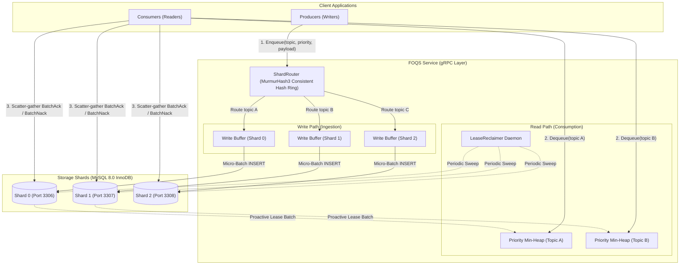

# FOQS (Facebook Ordered Queueing Service)

FOQS is an enterprise-grade, sharded priority message queue service built with Java 17, gRPC/Protobuf, and MySQL InnoDB.

> Inspired by Meta's production architecture: [**FOQS: Scaling a distributed priority queue** (Meta Engineering Blog)](https://engineering.fb.com/2021/02/22/production-engineering/foqs-scaling-a-distributed-priority-queue/).

## Key Features

- **Consistent Hashing Shard Routing**: Deterministic topic-to-shard partitioning via MurmurHash3 (`murmur3_128`) hash ring with virtual nodes ([`ShardRouter`](foqs-core/src/main/java/project/khaihust/foqs/core/config/ShardRouter.java)), ensuring uniform $\le 5\%$ distribution across shards with zero cross-shard lock contention.
- **High-Throughput Enqueue Pipeline**: Independent per-shard in-memory ring buffers ([`ShardedProducerBatch`](foqs-core/src/main/java/project/khaihust/foqs/core/buffer/impl/ShardedProducerBatch.java)) with asynchronous transactional micro-batch database insertion.
- **Low-Latency Dequeue Pipeline**: Proactive in-memory Min-Heap prefetching ([`PrefetchBatch`](foqs-core/src/main/java/project/khaihust/foqs/core/buffer/impl/PrefetchBatch.java)) maintaining priority ordering per topic.
- **Cross-Shard Scatter-Gather ACK & NACK**:
  - `BatchAck`: Fanned-out atomic completion marking (`status = 2`) across all database shards.
  - `BatchNack`: Exponential/fixed retry backoff with automatic Dead-Letter Queue (`status = 3`) routing across shards.
- **Automated Fault-Isolated Lease Reclamation**: Background multi-shard `LeaseReclaimer` monitoring expired leases and returning them to `READY` status with per-shard failure isolation.

## Architecture Design



### How It Works

1. **Write Path (Enqueue)**:
   - Producers submit messages with `(topic, priority, payload, deliver_after)` via gRPC.
   - [`ShardRouter`](foqs-core/src/main/java/project/khaihust/foqs/core/config/ShardRouter.java) hashes the topic to determine its target database shard.
   - Messages are queued in that shard's in-memory write buffer and flushed in transactional micro-batches (`INSERT INTO queue_messages`), avoiding per-message round-trips.
2. **Read Path (Dequeue)**:
   - For each active topic, a background replenisher proactively leases a batch of messages from MySQL into an in-memory priority min-heap.
   - Consumers call `Dequeue` and are served directly from RAM in $O(1)$ time with strict priority ordering (`priority ASC, id ASC`).
3. **Acknowledgment & Recovery**:
   - Consumers send `BatchAck` or `BatchNack` containing message UUIDs across shards; FOQS scatters the updates to each shard repository in parallel.
   - If a consumer crashes before acknowledging, [`LeaseReclaimer`](foqs-core/src/main/java/project/khaihust/foqs/core/buffer/impl/LeaseReclaimer.java) automatically sweeps expired leases across all shards and makes them available for redelivery.

## Performance & Benchmarking (`foqs-bench`)

FOQS includes an open-loop load testing module (`foqs-bench`) designed to avoid coordinated omission by scheduling sends at intended timestamps and capturing high-resolution latency percentiles with **HdrHistogram**.

### Empirical Results

#### 1. Horizontal Scaling: 1 Shard vs 3 Shards (Strict Parity: 2 vCPU & 2GB Buffer Pool per Shard, 60 Topics)

> **Headline Result**: **3 shards on 6 vCPU delivered 1.93x the throughput of 1 shard on 2 vCPU** (19,340 msg/s peak achieved vs 10,000 msg/s 1-shard knee). Total resources scaled with shard count.

| Configuration | Target Rate | Achieved Rate | p50 Latency | p95 Latency | p99 Latency | Host CPU% | Key Takeaway |
| :--- | :---: | :---: | :---: | :---: | :---: | :---: | :--- |
| **1 Shard (2 vCPU, 2G pool)** | 10,000 msg/s | 9,872–10,000 msg/s | 7.3–14.4 ms | 27.1–4,743 ms | **49.2–5,050 ms** | ~77% | **1-Shard Knee Boundary**: high tail latency jitter under buffer pressure |
| **3 Shards (6 vCPU, 6G total)** | 5,000 msg/s | 5,000.0 msg/s | **6.7 ms** | **13.6 ms** | **15.4–21.5 ms** | ~28% | Clean distribution across 3 shards; sub-22ms p99 |
| **3 Shards (6 vCPU, 6G total)** | 10,000 msg/s | 10,000.0 msg/s | **7.0 ms** | **14.7 ms** | **17.6–18.4 ms** | ~43% | **Tail Stabilization**: p99 drops from 50–5000ms to 18ms; host CPU halved |
| **3 Shards (6 vCPU, 6G total)** | 15,000 msg/s | 15,000.0 msg/s | **8.0 ms** | **18.1 ms** | **28.9–30.5 ms** | ~71% | **High Sustained Ingestion**: 15k msg/s sustained cleanly with sub-31ms p99 |
| **3 Shards (6 vCPU, 6G total)** | 20,000 msg/s | **19,340 msg/s** | 2,351 ms | 4,768 ms | **5,210 ms** | **97.1%** | **Peak Throughput Ceiling**: 1.93x scaling over 1-shard knee; host CPU saturated |

#### 2. Single Shard Baseline & Parameter Sweeps (4GB Buffer Pool, Single Topic)

| Benchmark Scenario | Target Rate | Achieved Rate | p50 Latency | p95 Latency | p99 Latency | Key Takeaway |
| :--- | :---: | :---: | :---: | :---: | :---: | :--- |
| **Baseline (Linear Regime)** | 1,000 msg/s | 999.98 msg/s | **7.4 ms** | **14.3 ms** | **24.6 ms** | Sub-25ms p99 latency with zero queue buildup |
| **Baseline (High Efficiency)** | 5,000 msg/s | 4,999.98 msg/s | **6.4 ms** | **16.5 ms** | **33.4 ms** | Micro-batching keeps tail latency tightly bounded |
| **Baseline (Sweet Spot)** | 6,000 msg/s | 5,999.97 msg/s | **7.3 ms** | **25.9 ms** | **94.9 ms** | Sub-100ms p99 with 8ms p50 |
| **Baseline (High Load)** | 8,000 msg/s | 7,999.98 msg/s | **8.1 ms** | **37.1 ms** | **80.7 ms** | High ingestion throughput sustained cleanly |
| **Baseline (Max Single Shard)** | 10,000 msg/s | 9,999.98 msg/s | **8.6 ms** | **79.0 ms** | **167.6 ms** | 10k msg/s sustained with 13.3k msg/s dequeue capacity |
| **Optimal Batching** (`bt=50, fi=5ms`) | 4,800 msg/s | 4,799.97 msg/s | **3.2 ms** | **12.3 ms** | **25.3 ms** | Lowest p99 in grid (25.3ms) with zero filesort |
| **Backlog (560k depth, 512M pool)** | 4,800 msg/s | 4,799.99 msg/s | **7.3 ms** | **16.8 ms** | **23.6 ms** | Filesort completely eliminated via optimized index |
| **Lease Recovery (150k messages)** | 5,000 msg/s | — | — | — | **~30.0 s** | 100% of 150k un-acked messages reclaimed upon expiry |

### Running Benchmarks

#### Quick Smoke Test (30 seconds)
```bash
./foqs-bench/scripts/run-bench-smoke.sh
```

#### 1-Shard vs 3-Shard Horizontal Scaling Ramp (60 Topics)
```bash
./foqs-bench/scripts/run-e2-scaling.sh
```

#### Full Single-Shard Experiment Matrix
```bash
./foqs-bench/scripts/run-bench-full.sh
```

> **Multi-Topic Flag**: Pass `--topics=N` (default: 60) to distribute load evenly round-robin across topics, testing consistent hashing and multi-shard striping under full multi-tenancy.

---

## Quick Start & How to Run

### Prerequisites

- **Java 17+** (JDK)
- **Maven 3.8+**
- **Docker & Docker Compose**

---

### Step 1: Start MySQL Database Shards (3-Shard Cluster)

Launch the MySQL 8.0 shard containers (Shard 0 on port 3306, Shard 1 on port 3307, Shard 2 on port 3308):

```bash
docker compose -f docker/docker-compose.yml up -d
```

---

### Step 2: Run Database Migrations

Apply Liquibase schema migrations (`queue_messages` table and composite indexes) across all configured shards:

```bash
mvn clean compile exec:java -pl foqs-migration -Dexec.mainClass="project.khaihust.foqs.migration.MigrationRunner"
```

---

### Step 3: Build & Run Test Suite

Run all unit and full-flow end-to-end integration tests:

```bash
mvn clean test
```

---

### Step 4: Start FOQS gRPC Server

Start the core FOQS service (listens on port `8080` by default):

```bash
mvn exec:java -pl foqs-core -Dexec.mainClass="project.khaihust.foqs.core.Application"
```

---

### Step 5: Test with `grpcurl`

#### 1. Enqueue a message:
```bash
grpcurl -plaintext -d '{
  "topic": "orders",
  "priority": 1,
  "payload": "eydvcmRlcklkJzogOTkwMX0=",
  "deliver_after": 0
}' localhost:8080 project.khaihust.foqs.core.proto.EnqueueService/Enqueue
```

#### 2. Dequeue messages:
```bash
grpcurl -plaintext -d '{
  "topic": "orders",
  "count": 5,
  "timeout": 3000
}' localhost:8080 project.khaihust.foqs.core.proto.DequeueService/Dequeue
```

#### 3. Batch Acknowledge (ACK):
```bash
grpcurl -plaintext -d '{
  "message_ids": ["<MESSAGE_UUID>"]
}' localhost:8080 project.khaihust.foqs.core.proto.DequeueService/BatchAck
```

#### 4. Batch Negative Acknowledge (NACK):
```bash
grpcurl -plaintext -d '{
  "message_ids": ["<MESSAGE_UUID>"],
  "retry_delay_ms": 5000,
  "max_retry_count": 3
}' localhost:8080 project.khaihust.foqs.core.proto.DequeueService/BatchNack
```

---

## Documentation

Full architectural design, sequence diagrams, design mapping with Meta's paper, gRPC API reference, and detailed benchmark analysis are available in [DOCS.md](DOCS.md).


